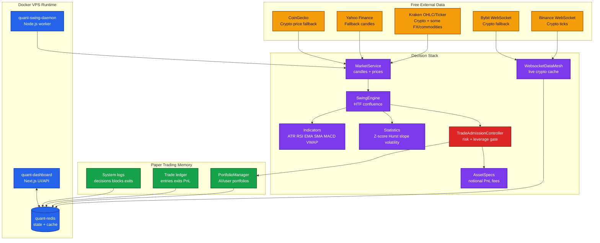
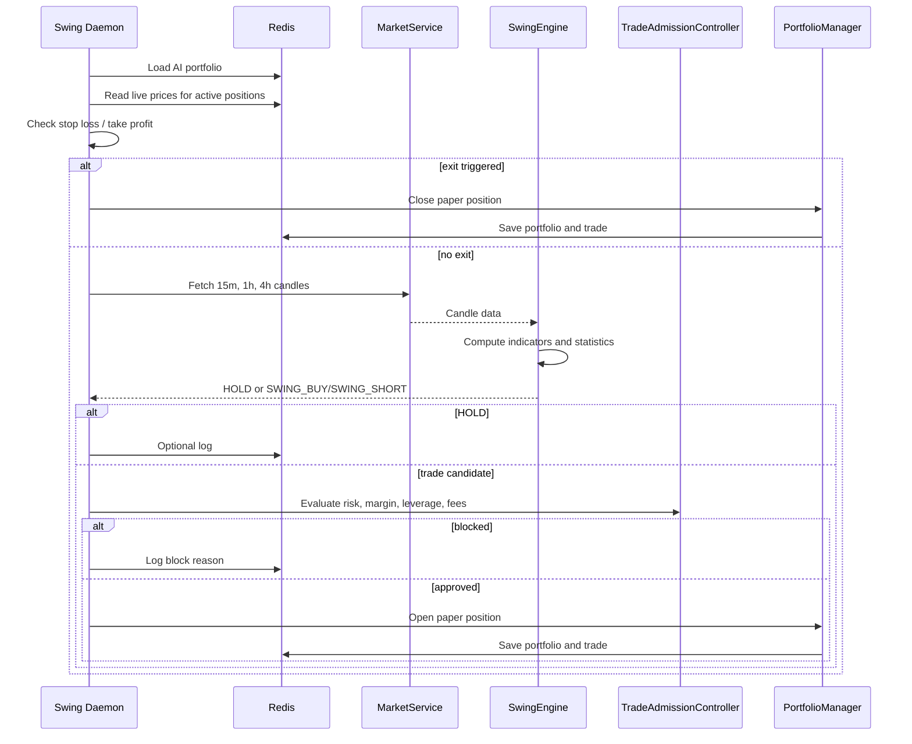

# Autonomous AI Paper Trading Architecture

This document describes the current v6 architecture: a free-first, math-led, autonomous swing paper trading system designed to run continuously on an Oracle Cloud free VPS or local Docker machine.

The system is not a true HFT engine. It is a selective autonomous swing engine with live price awareness, strict trade admission, and optional AI/LLM support.

---

## Core Principle

The bot should not trade because time passed. It should trade only when the market presents a statistically meaningful setup.

That means the correct behavior can be:

- no trade for many cycles,
- no trade for several days,
- one trade only when 15m, 1h, and 4h structure align,
- smaller size when confidence is weaker,
- no trade when risk, feed quality, or portfolio exposure is poor.

The system should be judged by the quality of decisions, not by how frequently it enters.

---

## Architecture Diagram

---

## Runtime Components

### 1. Next.js Dashboard

The dashboard is the visible control and review surface.

Responsibilities:

- show AI and user portfolio state,
- show active positions,
- show trade history,
- show chart and price data,
- expose API routes for status, manual trading, reset, prices, chart data, and strategy scans,
- keep the human informed without becoming the decision engine.

The dashboard should not be the trading brain. It reads system state and allows controlled manual actions.

### 2. Redis State Store

Redis is the local state layer.

Responsibilities:

- AI portfolio,
- user portfolio,
- active open positions,
- trade history,
- live market price cache,
- orderbook imbalance cache,
- candle cache,
- logs,
- cooldown flags.

Redis is used because it is free, fast, simple, and local to the VPS.

### 3. Swing Daemon

The daemon is the autonomous worker.

Responsibilities:

- start WebSocket price mesh,
- scan active positions for exits,
- scan supported assets for entries,
- run the `SwingEngine`,
- call the `TradeAdmissionController`,
- write approved paper trades to portfolio state,
- log holds, blocks, entries, and exits.

Current behavior:

- entry/exit daemon tick: 60 seconds,
- summary log: every 5 minutes,
- cooldown after closed swing trade: 1 hour per asset,
- no duplicate open position in the same asset.

---

## Decision Flow

---

## Signal Logic

The `SwingEngine` uses higher-timeframe confluence.

Primary timeframes:

- 15m for execution context,
- 1h for regime and Z-score,
- 4h for broader structure.

Current signal ingredients:

- Hurst exponent,
- regression slope,
- volatility percentile,
- price Z-score,
- VWAP deviation,
- ATR-based stop distance,
- ATR-based take-profit distance.

Current minimum trade score:

- score must be at least 14,
- buy score must beat short score for long entries,
- short score must beat buy score for short entries.

This makes the system patient. It may ignore most market movement.

---

## Trade Admission Logic

The `TradeAdmissionController` is the risk gate.

It checks:

- valid portfolio equity,
- valid entry price,
- valid stop loss,
- stop loss direction correctness,
- no duplicate active position for the asset,
- remaining total portfolio margin room,
- max trade margin by asset type,
- max total active margin,
- risk budget,
- notional size,
- leverage,
- entry fee,
- fee drag,
- maximum planned loss.

Risk model:

- base risk: 1.5% of equity,
- total active margin cap: 25% of equity,
- drawdown reduces risk automatically,
- leverage increases only with stronger signal score.

Leverage ladder:

| Signal Score | Max Leverage Before Asset Cap |
| --- | --- |
| 14-15 | 1.5x |
| 16-18 | 2x |
| 19-21 | 3x |
| 22+ | 5x |

This means the bot can use leverage, but only after risk and signal quality checks.

---

## LLM Role

LLM APIs are optional.

The core swing daemon can operate without Gemini, Groq, or OpenRouter because the current trade path is math-first.

The correct LLM role is:

- reflection,
- explanation,
- post-trade review,
- market context,
- journal summarization,
- optional safety review.

The LLM should not be a single point of failure for opening or closing paper trades.

---

## Timing Model

The system should be understood in layers:

| Layer | Correct Timing | Purpose |
| --- | --- | --- |
| WebSocket price cache | near real time where available | keep latest crypto price available |
| Active position watchdog | ideally 1-5 seconds in a future upgrade | react faster to SL/TP |
| Current daemon scan | 60 seconds | evaluate active positions and new entries |
| Candle strategy | 15m / 1h / 4h | avoid noisy one-second scalping |
| Reflection/LLM | slow and cached | non-critical intelligence layer |

The next upgrade should be a faster exit watchdog, not one-second full trade entry scanning.

---

## Why The Bot May Trade Rarely

Rare trading is not automatically a bug.

The bot may hold because:

- 1h Z-score is not extreme,
- 4h structure is weak,
- volatility regime is poor,
- score is below 14,
- another position is already open,
- cooldown is active,
- margin cap is reached,
- fee drag is too high,
- stop distance creates bad risk/reward,
- data feed fails or returns stale data.

The dashboard should make these reasons visible so the human sees patience instead of silence.

---

## Free System Constraints

The system is optimized for zero ongoing cost.

Accepted constraints:

- free VPS resources,
- free public data feeds,
- optional free LLM tiers,
- no paid market data,
- no paid orchestration,
- no required hosted database,
- paper trading by default.

Technical implications:

- avoid aggressive polling,
- cache candles,
- prefer WebSocket where free,
- keep Docker images lean,
- prune build cache periodically,
- keep logs bounded,
- make LLM usage optional and rate-limit aware.

---

## What Would Make It Stronger

Highest-value next upgrades:

1. Add a fast active-position exit watchdog.
2. Log every rejected setup with the exact reason.
3. Build per-setup analytics by asset, score, regime, and timeframe.
4. Train local ML only from real completed paper trade outcomes.
5. Add feed health scoring before every trade.
6. Add dashboard visibility for "why no trade."
7. Add automatic cool-down after consecutive losses.
8. Add a daily performance review job.
9. Keep all live trading paths disabled unless explicitly confirmed.

The architecture is now suitable for disciplined autonomous paper swing trading. It should evolve toward better evidence, better review, and better patience rather than noisier trading frequency.
