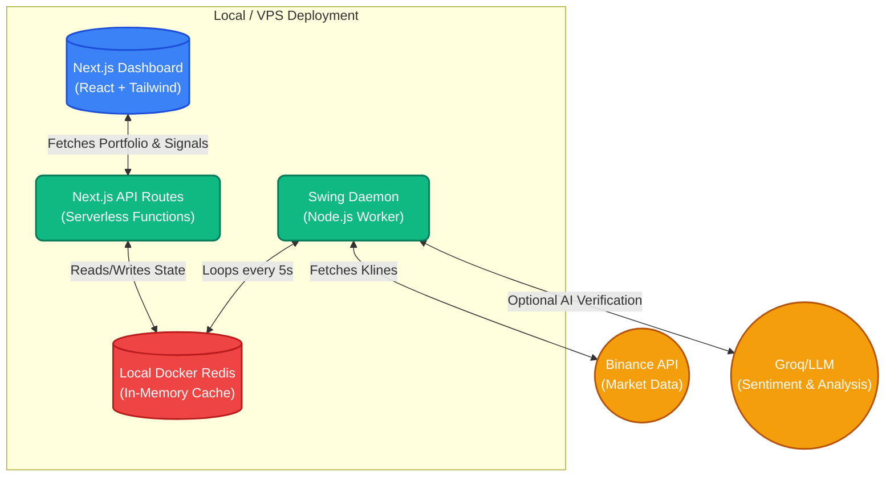

# Autonomous Quant Trading Agent Architecture

Welcome to the **Autonomous Quant Trading Agent** architecture documentation. This system is a high-performance, deterministic quantitative swing trading platform built on a pure **Next.js**, **Node.js Daemon**, and **Local Redis** stack.

## 🌟 Architectural Philosophy

1. **Deterministic Math Engine**: Uses custom implementations of ATR, RSI, EMA, SMA, and MACD to ensure consistent, transparent signal generation.
2. **Confluence Swing Trading**: The bot utilizes a high-confluence swing trading strategy evaluated over 15m, 1h, and 4h timeframes.
3. **Zero-Latency State**: All data is managed through an ultra-fast local Docker Redis instance, eliminating external network dependencies and latency for state management.
4. **Single Source of Truth**: All trading logic is encapsulated cleanly within the background Node.js daemon.

---

## 🏛️ System Architecture

The following Mermaid diagram illustrates the self-contained, high-performance flow of the system.



---

## ⚙️ Core Components

### 1. Local Docker Redis (State Manager)
Running as `quant-redis` via `docker-compose`, this is the heart of the system. It is blazing fast and handles all state:
- `user:portfolio`: Tracks the virtual USD balance and open positions.
- `ai:trades`: The historical ledger of completed paper trades.
- `ai:signals`: Real-time output from the Math engine for dashboard visualization.
- `system:logs`: Transparent internal logging of the Daemon's decisions.

### 2. The Next.js Dashboard (`quant-dashboard`)
A visually stunning, institutional-grade user interface built with TailwindCSS, Lucide React, and Lightweight Charts.
- **Real-Time Updates**: Polls the Next.js API routes periodically to refresh the UI.
- **Glassmorphism Design**: Uses deep blacks, vibrant neon accents, and smooth transitions to look like a state-of-the-art quant terminal.
- **Manual Control**: Allows the user to manually enter or exit trades directly into the Redis cache.

### 3. The Swing Daemon (`quant-swing-daemon`)
A dedicated Node.js process (`src/daemon/swingDaemon.ts`) that runs continuously in the background.
- **Market Data Fetching**: Pulls precise OHLCV candlestick data from Binance for multiple pairs (BTC, ETH, SOL, GOLD, etc.).
- **Math Engine**: Computes technical indicators without relying on black-box external libraries.
- **Confluence Scoring**: Evaluates signals across multiple timeframes. A trade is only executed if the mathematical score exceeds a strict threshold.
- **Risk Management**: Implements dynamic position sizing using the Kelly Criterion and ATR-based stop losses to protect the portfolio.

---

## 🚀 Deployment & Operations

The agent is designed to be effortlessly deployed to a zero-cost VPS (like Oracle Cloud A1.Flex) or run locally on a developer machine.

### Local Development
```bash
# 1. Start the Local Redis container
docker compose up -d redis

# 2. Start the Dashboard
npm run dev

# 3. Start the Swing Daemon (in a separate terminal)
npm run daemon:swing
```

### Production / VPS Deployment
The entire stack is containerized for production.
```bash
# Bring up the full architecture
docker compose up -d --build
```
