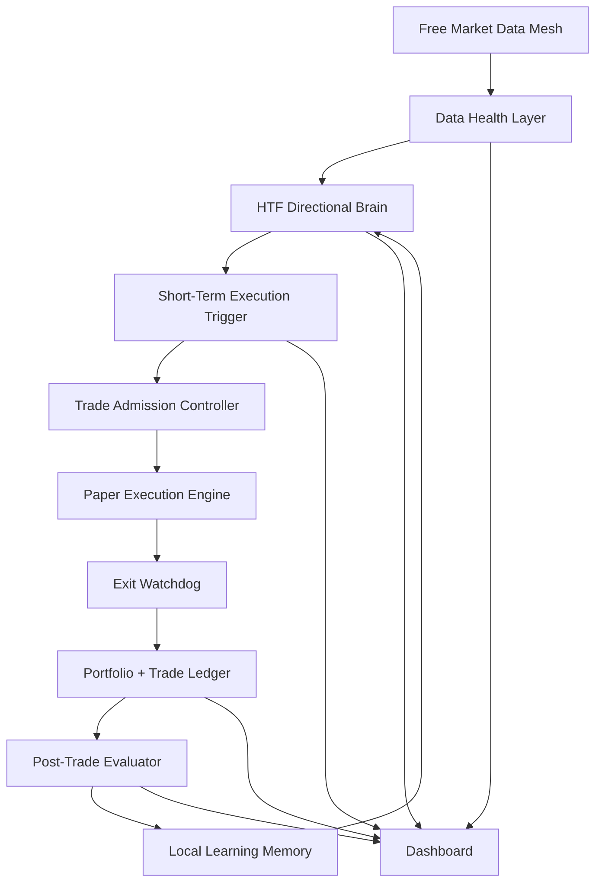

# Final Autonomous Trading System Upgrade Plan

Date: 2026-06-10  
Project: AI Quant Trader / Autonomous Paper Trading Agent  
Deployment target: Oracle Free Tier VPS, Docker Compose, Redis, Next.js dashboard  
Primary constraint: zero paid infrastructure, zero paid market-data dependency, paper trading only

## 1. Executive Summary

The current system is technically alive and stable, but the trading brain is still too conservative, too slow on execution, and not learning enough from missed opportunities. The live dashboard proves that the daemon is scanning, the VPS is healthy, Redis is storing state, and the dashboard can show scan freshness. The weakness is not uptime. The weakness is decision quality.

The final upgrade should convert the bot from a simple higher-timeframe confluence scanner into a two-layer autonomous trading system:

1. A higher-timeframe brain that decides whether an asset has directional edge.
2. A short-term execution trigger that waits for live confirmation before entering.

The goal is not to make the bot trade constantly. The goal is to make it see more of the opportunities that are obvious on the chart, avoid weak entries, size stronger setups more meaningfully, and explain every decision after the fact.

This plan is designed for the free-only version. It does not assume paid APIs, paid servers, paid LLMs, paid market feeds, or paid observability. It uses local computation, Redis, public/free exchange feeds, cached HTTP data, and plain JSON/Markdown evaluation reports.

Important warning: this plan can make the system more realistic, observable, and disciplined. It cannot guarantee profit. The correct target is measurable improvement: better entry quality, fewer weak trades, clearer misses, and stronger paper-trading evidence before any future real-money version is considered.

## 2. Current System Diagnosis

### 2.1 What is working

- VPS deployment is stable.
- Docker containers are running continuously.
- Redis is preserving portfolio and scan state.
- The swing daemon is scanning every minute.
- Exit watchdog checks open positions every 5 seconds.
- Dashboard API returns live portfolio, trade, and scan data.
- Crypto prices are supported with live WebSocket feeds.
- Market-session guard prevents forex/commodity entries when markets are closed.
- Fake manual rows were removed.
- The V6 AI winning trade was restored into the AI ledger.
- Current dashboard visibility is improved with scan ID, scan runtime, and per-asset timestamps.

### 2.2 What is not working well enough

- The bot is missing many visually obvious short-duration opportunities.
- The current swing engine only checks 15m, 1h, and 4h candles.
- Entry logic uses a candle snapshot price instead of always using live execution price.
- Most live entries happened at the minimum allowed score of 14.
- Score 14 currently maps to only 1.5x leverage and small margin usage.
- The bot is too conservative for the user's desired high-conviction paper-trading behavior.
- The UI has scalp/HFT sections, but there is no real scalp daemon in the deployed Docker stack.
- Forex and commodity data is not strong enough for true high-frequency trading in free mode.
- Reflection/self-learning is not yet converting trade outcomes into practical rule changes.
- Missed opportunities are not being stored, labeled, or evaluated later.
- The bot cannot currently prove whether a skipped setup would have won or lost.

## 3. Final Design Philosophy

The final system should be:

- Free-first: no paid APIs, no paid monitoring, no paid LLM requirement.
- Autonomous: the bot should scan, decide, execute, manage, and review without manual clicking.
- Selective: no overtrading for activity.
- Evidence-based: every entry, skipped entry, and exit should be measurable later.
- Crypto-first for fast data: use Binance and Bybit WebSockets for real-time short-term execution.
- Multi-asset swing for slower assets: forex and commodities can remain in the system, but only as slower swing instruments unless free reliable low-latency feeds are verified.
- Explainable: every trade must have a decision packet that explains why it entered, why it sized that way, and why it exited.
- Honest: no synthetic performance inflation, no hidden manual repair of results, no fake recovery rows.

## 4. Target Architecture



The key upgrade is adding the missing layer between the higher-timeframe brain and trade admission:

- Current system: HTF signal -> trade admission -> entry.
- Final system: HTF signal -> short-term trigger -> trade admission -> entry.

That one architectural change should reduce weak entries and increase the chance that a trade starts with actual live momentum.

## 5. Phase 1 - Data Mesh Upgrade

### 5.1 Objective

Make the bot's view of price action more reliable and more transparent. The bot should know whether it is using live tick data, cached candles, Yahoo fallback data, or stale data.

### 5.2 Current issue

Crypto has useful live feeds. Forex and commodities are mostly HTTP/candle fallback based. The strategy should not treat all assets as equally real-time.

### 5.3 Implementation tasks

#### 5.3.1 Add a data quality score per asset

Create a normalized data quality score from 0 to 100:

- 100: live WebSocket price plus recent candles plus source agreement.
- 80: live price plus cached candles under allowed age.
- 60: HTTP price plus recent candles.
- 40: stale candle fallback but still usable for slow swing context.
- 0: missing or contradictory data.

Store in Redis:

- `market:quality:BTC`
- `market:quality:ETH`
- `market:quality:SOL`
- `market:quality:EURUSD`
- `market:quality:GBPUSD`
- `market:quality:USDJPY`
- `market:quality:GOLD`
- `market:quality:OIL`
- `market:quality:SILVER`

Dashboard should show:

- data source
- last tick time
- candle age
- data quality score
- whether the asset is eligible for fast execution

#### 5.3.2 Separate asset modes

Define each asset as one of:

- `REALTIME_FAST`: BTC, ETH, SOL
- `SLOW_SWING`: EURUSD, GBPUSD, USDJPY, GOLD, OIL, SILVER
- `DISABLED`: any asset with repeated bad data

Crypto can use:

- WebSocket price
- order book imbalance
- funding rate
- open interest where available
- 1m/5m execution candles

Forex and commodities should use:

- 15m/1h/4h swing context
- stricter session rules
- no "HFT" label
- no one-minute aggressive entry unless free data health is proven

#### 5.3.3 Fix live execution price usage

Current weakness: swing entry logic is based on `snap15m.price`. The final system should:

1. Use candles for analysis.
2. Use `MarketService.getCurrentPrice(asset)` for execution price.
3. Reject the trade if live price has moved too far from the signal candle.

Add a slippage gate:

- Crypto: reject if live price is more than 0.15% away from signal price.
- Forex: reject if live price is more than 0.08% away.
- Commodities: reject if live price is more than 0.20% away.

#### 5.3.4 Free-data reality for forex and commodities

Forex and commodities should not be described as true HFT in free mode. Free sources can be useful for paper swing simulation, but not for professional tick-by-tick execution.

Important current external-data reality:

- Binance USD-M futures WebSocket supports high-frequency public market streams, but it is crypto derivatives focused.
- Bybit public ticker streams can push derivative ticker updates frequently for supported crypto contracts.
- Alpha Vantage FX intraday exists, but current documentation labels FX_INTRADAY as a premium function, so it cannot be treated as a guaranteed free real-time forex engine.

Final rule:

- Use crypto for fast execution experiments.
- Use forex/commodities for slower swing logic only.
- If a free forex source is added later, put it behind a `DataProviderAdapter` and prove rate limits, freshness, and reliability before allowing faster entries.

## 6. Phase 2 - Two-Layer Trading Brain

### 6.1 Objective

Stop entering just because HTF score reaches the minimum threshold. Require a short-term confirmation layer before the bot commits capital.

### 6.2 Layer 1: HTF directional brain

This layer answers:

- Is the asset structurally bullish, bearish, mean reverting, or choppy?
- Is there enough volatility to matter?
- Is there enough trend persistence to avoid noise?
- Is this asset worth watching right now?

Inputs:

- 15m candles
- 1h candles
- 4h candles
- ATR
- VWAP deviation
- Hurst exponent
- regression slope
- volatility percentile
- z-score
- source/data quality
- asset session state

Outputs:

- `bias`: LONG, SHORT, or NEUTRAL
- `htfScore`: 0 to 30
- `regime`: TRENDING, MEAN_REVERTING, CHOPPY, BREAKOUT, SQUEEZE
- `watchReason`
- `invalidations`

### 6.3 Layer 2: short-term execution trigger

This layer answers:

- If the HTF brain says "watch long", is there a good live entry now?
- Is the asset breaking out, reclaiming VWAP, sweeping liquidity, or rejecting resistance/support?
- Is the entry late?
- Is price moving too fast against us?

Inputs for crypto:

- live WebSocket price
- 1m candles
- 5m candles
- 5m VWAP
- 1m/5m RSI or momentum
- order book imbalance
- volume burst
- candle body strength
- distance from HTF invalidation

Inputs for forex/commodities:

- latest available price
- 5m/15m candle confirmation if available
- session check
- spread/staleness guard
- no HFT assumptions

Execution trigger examples:

Long trigger:

- HTF bias is LONG.
- Price is above 5m VWAP.
- 1m close is above prior 1m high.
- 5m candle body is positive.
- Volume or volatility is above recent average.
- Live price is not more than allowed slippage from signal.

Short trigger:

- HTF bias is SHORT.
- Price is below 5m VWAP.
- 1m close is below prior 1m low.
- 5m candle body is negative.
- Volume or volatility is above recent average.
- Live price is not more than allowed slippage from signal.

### 6.4 New decision states

Replace simple `HOLD` with clearer states:

- `NO_BIAS`: no HTF edge.
- `WATCH_LONG`: HTF long bias exists, waiting for trigger.
- `WATCH_SHORT`: HTF short bias exists, waiting for trigger.
- `TRIGGER_PENDING`: trigger almost formed but not confirmed.
- `ENTRY_READY`: both layers agree.
- `BLOCKED_RISK`: setup passed but risk sizing blocked.
- `BLOCKED_DATA`: data quality not good enough.
- `BLOCKED_SESSION`: market closed or stale session.
- `COOLDOWN`: asset cooling down after recent exit.

This will make the dashboard much more useful than repeatedly showing `HOLD 9`.

## 7. Phase 3 - Score Model Upgrade

### 7.1 Objective

Make scores meaningful. A score of 14 should not mean "good trade." It should mean "bare minimum watch condition."

### 7.2 Current problem

Most trades entered at score 14. That is too weak for autonomous high-conviction trading.

### 7.3 New score bands

Use a two-part score:

- `htfScore`: 0 to 30
- `triggerScore`: 0 to 30
- `qualityScore`: 0 to 20
- `riskScore`: 0 to 20

Total score: 0 to 100

Trade bands:

- 0 to 49: no trade
- 50 to 59: watch only
- 60 to 69: tiny probe in paper mode only
- 70 to 79: normal trade
- 80 to 89: high conviction
- 90 to 100: rare aggressive paper trade

### 7.4 Inputs to score

HTF score:

- trend alignment
- Hurst/trend persistence
- volatility regime
- regression slope
- z-score/reversion condition
- squeeze/breakout condition

Trigger score:

- 1m/5m momentum confirmation
- VWAP reclaim/rejection
- volume burst
- candle body strength
- order book imbalance for crypto
- price not late

Quality score:

- live price available
- candle freshness
- no source disagreement
- no repeated API failure
- no session issue

Risk score:

- stop distance sensible
- reward/risk at least 2:1
- fee drag acceptable
- current drawdown acceptable
- recent performance for same setup category acceptable

## 8. Phase 4 - Position Sizing Upgrade

### 8.1 Objective

Allow stronger paper-trading size only when the setup quality justifies it.

### 8.2 Current problem

The system caps each asset at about 10% margin and score 14 gives only 1.5x leverage. This makes outcomes tiny. It is safe, but too weak for the desired paper-trading demonstration.

### 8.3 New sizing ladder

For AI paper trading:

- Score 60-69: 5% margin, 1x leverage
- Score 70-79: 10% margin, 1.5x to 2x leverage
- Score 80-89: 15% margin, 2x to 3x leverage
- Score 90-100: 20% margin, 3x to 5x leverage

Hard caps:

- Maximum total active margin: 35% of equity.
- Maximum one asset margin: 20% of equity.
- Maximum crypto group margin: 25% of equity.
- Maximum forex group margin: 15% of equity.
- Maximum commodity group margin: 15% of equity.

Drawdown protection:

- Drawdown 0-2%: normal sizing.
- Drawdown 2-4%: reduce new size by 25%.
- Drawdown 4-6%: reduce new size by 50%.
- Drawdown above 6%: watch-only mode.
- Drawdown above 8%: stop autonomous entries until manually reset.

### 8.4 Special rule for high-stakes paper trades

High-stakes trades should only happen when:

- score is 80+
- data quality is 80+
- setup category has positive historical expectancy
- asset is not in cooldown
- no same-direction correlated exposure already exists
- stop loss and take profit are valid
- live entry is not late
- no recent 3-loss streak in same setup type

This gives the user the desired "bigger when confident" behavior without turning the bot into a reckless random executor.

## 9. Phase 5 - Exit Logic Upgrade

### 9.1 Objective

Stop letting trades either die at fixed stop or wait too long. The bot needs smarter exits.

### 9.2 Current issue

The system has a 5-second watchdog, which is good, but the exit model should better distinguish:

- hard stop loss
- trailing stop profit
- time-based exit
- signal invalidation
- partial profit
- breakeven protection

### 9.3 New exit states

Replace confusing labels with:

- `HARD_STOP_LOSS`
- `TAKE_PROFIT`
- `TRAILING_STOP_PROFIT`
- `BREAKEVEN_STOP`
- `SIGNAL_INVALIDATION`
- `TIME_STOP`
- `DATA_SAFETY_EXIT`

This matters because the recent GBPUSD trade showed as `STOP_LOSS` despite being slightly profitable. That is confusing for dashboard interpretation.

### 9.4 Exit rules

For all trades:

- If price hits hard stop: exit immediately.
- If price reaches 1R profit: move stop to breakeven plus fees.
- If price reaches 1.5R profit: trail by 0.75R.
- If price reaches 2R profit: either take partial profit or trail tighter.
- If signal flips hard against position: exit.
- If data becomes stale: exit or reduce risk.

For crypto fast trades:

- Add time stop: if no movement after 15-30 minutes, exit.
- Add momentum stop: if 5m trigger fails after entry, exit.

For slower swing trades:

- Use wider time stop: 6-24 hours depending on asset/session.
- Do not use scalp-style tight trailing unless asset is in fast mode.

### 9.5 Crypto signal reversal and minute trigger sprint

The bot must not stay trapped in a short or long thesis when the market clearly flips. The current fix adds a crypto-only signal reversal path:

- During the one-minute entry scan preflight, active BTC, ETH, and SOL positions are rechecked against the swing brain.
- Hard stop loss and take profit still take priority.
- If an active short is invalidated by a strong long setup, the bot can close the short with `SIGNAL_REVERSAL`.
- If an active long is invalidated by a strong short setup, the bot can close the long with `SIGNAL_REVERSAL`.
- Reversal checks are not run every 5 seconds because they fetch 1m, 5m, 15m, 1h, and 4h context.
- After a reversal close, no one-hour cooldown is applied, so the normal entry loop can evaluate the opposite setup immediately.

Reversal requires all of these:

- asset is BTC, ETH, or SOL,
- opposite signal is entry-grade (`SWING_BUY` against a short or `SWING_SHORT` against a long),
- data quality is at least 80,
- trigger score is at least 14,
- final conviction is at least 70,
- higher-timeframe score is at least 8,
- live price slippage from the signal candle is no more than 0.25%.

This is not a guarantee that reversals will win. It is a protection layer that lets the bot admit the original thesis is invalidated and, if the new setup remains valid, take the opposite direction through the same risk controller.

## 10. Phase 6 - Missed Opportunity Learning

### 10.1 Objective

Teach the bot from missed opportunities, not only executed trades.

### 10.2 Current problem

If the bot says `HOLD`, that decision disappears except for the latest snapshot. The system cannot later ask:

- Did the bot miss a good trade?
- Would the setup have won?
- Which indicator was too strict?
- Which score threshold prevented a profitable entry?

### 10.3 Opportunity journal

Every scan should record a compact opportunity packet when an asset reaches a meaningful watch level.

Store:

- asset
- timestamp
- current price
- htfScore
- triggerScore
- totalScore
- action state
- reason
- data quality
- regime
- top positive signals
- top negative signals
- hypothetical stop
- hypothetical take profit
- decision: no trade, watch, blocked, entry

Redis keys:

- `opportunity:latest`
- `opportunity:history`
- `opportunity:evaluation:pending`

Persist periodic JSON:

- `data/opportunity_journal.json`
- `data/opportunity_evaluations.json`

### 10.4 Delayed evaluation

After 15m, 1h, 4h, and 24h, evaluate each missed setup:

- max favorable excursion
- max adverse excursion
- whether take profit would have hit
- whether stop loss would have hit
- whether entry was early, late, or correct
- whether score threshold was too strict

This gives the bot a learning loop without paid ML.

### 10.5 Path-aware opportunity evaluation sprint

The opportunity learning loop must evaluate the path of a missed setup, not only the final price at the review time.

The current sprint upgrades each watched, blocked, skipped, or entered directional setup so it can carry:

- planned entry price,
- planned stop loss,
- planned take profit,
- direction,
- setup tags,
- final conviction,
- data quality,
- trigger score.

When a delayed evaluation becomes due, the evaluator now checks the price path using the most practical free candle resolution:

- 15m review: 1m candles,
- 1h review: 5m candles,
- 4h review: 15m candles,
- 24h review: 1h candles.

For every reviewed opportunity, store:

- final move percent,
- maximum favorable excursion,
- maximum adverse excursion,
- whether the hypothetical take profit was touched,
- whether the hypothetical stop loss was touched,
- which one was touched first,
- conservative outcome label.

If a stop and target are both touched inside the same candle, treat stop loss as first for learning purposes. This is conservative, but it prevents the bot from learning over-optimistic results from candle data that cannot prove the true intrabar order.

This solves an important user-facing problem: when a BTC short loses but a BTC long setup later appears visually obvious, the bot should be able to later answer:

```text
Did the missed long setup actually follow through?
Would it have hit target before stop?
Was the bot too strict, or was the visual setup only temporary noise?
```

The local learning memory should use these path-aware results:

- repeated target-heavy patterns can slightly boost future confidence,
- repeated stop-heavy patterns can reduce confidence,
- repeated bad patterns can push the bot into watch-only behavior,
- setup performance can become evidence-based instead of opinion-based.

## 11. Phase 7 - Local Self-Learning Memory

### 11.1 Objective

Make reflection useful and local. No paid LLM is required.

### 11.2 Setup categories

Every trade and opportunity should be labeled:

- `HTF_TREND_BREAKOUT`
- `SQUEEZE_BREAKOUT`
- `VWAP_RECLAIM`
- `VWAP_REJECTION`
- `MEAN_REVERSION_EXTREME`
- `LIQUIDITY_SWEEP_REVERSAL`
- `MOMENTUM_CONTINUATION`
- `CHOP_AVOIDED`
- `DATA_BLOCKED`

### 11.3 Per-category stats

For each setup category, track:

- total executed trades
- win rate
- average win
- average loss
- profit factor
- average max favorable excursion
- average max adverse excursion
- average holding time
- best asset
- worst asset
- best session
- worst session
- score bands that worked
- score bands that failed

### 11.4 Adaptive rule memory

Generate simple local rules:

- "Do not take USDJPY squeeze breakout shorts below score 75."
- "Crypto VWAP reclaim setups above score 80 have positive expectancy."
- "Avoid forex trades during low volatility percentile."
- "Reduce size after two failed setups in same asset."

Store as JSON:

- `data/local_rules.json`

Use these rules in the admission controller before allowing a trade.

## 12. Phase 8 - Free LLM Strategy

### 12.1 Objective

Keep LLM optional. The bot must work without Gemini/OpenAI/Hugging Face uptime.

### 12.2 LLM role

LLM should not be the entry trigger. LLM should be used for:

- summarizing daily performance
- explaining why trades happened
- generating reflection notes
- reviewing failed setups
- creating human-readable reports

LLM should not be required for:

- price fetching
- signal scoring
- entry execution
- exit execution
- risk sizing

### 12.3 Free-mode fallback

If all LLM APIs fail:

- continue trading logic normally
- generate deterministic reflection from stats
- show "LLM unavailable, rule engine active" on dashboard
- cache prior reflection

## 13. Phase 9 - Dashboard Upgrade

### 13.1 Objective

Make the dashboard show whether the bot is actually intelligent, not just alive.

### 13.2 New dashboard panels

Add:

1. Data Health Matrix
   - asset
   - live source
   - candle age
   - data score
   - eligible mode

2. Opportunity Radar
   - assets in `WATCH_LONG`
   - assets in `WATCH_SHORT`
   - current scores
   - missing trigger

3. Decision Breakdown
   - HTF score
   - trigger score
   - data score
   - risk score
   - final decision

4. Missed Opportunity Review
   - best missed setup
   - would-have-hit TP
   - would-have-hit SL
   - reason missed

5. Setup Performance
   - win rate by setup
   - profit factor by setup
   - best/worst asset

6. Risk Mode
   - normal
   - reduced
   - cooldown
   - watch-only
   - stopped

### 13.3 Text labels

Avoid vague labels:

- Do not show only `HOLD`.
- Show why:
  - `NO_BIAS`
  - `WATCH_LONG`
  - `TRIGGER_PENDING`
  - `BLOCKED_DATA`
  - `BLOCKED_RISK`

The dashboard should make it obvious whether the bot is missing opportunity, waiting correctly, or blocked for a good reason.

### 13.4 Spectator-friendly dashboard language

The dashboard should not read like a developer console. A normal spectator should understand what the bot is doing without knowing trading math, Hurst exponent, VWAP, ATR, regression slope, or confluence scoring.

Every technical state should have two versions:

1. Internal state for the system.
2. Plain-language display for humans.

Examples:

| Internal State | Spectator Display | Meaning |
|---|---|---|
| `NO_BIAS` | No clear opportunity yet | The market is not showing a strong direction. |
| `WATCH_LONG` | Watching for a buy setup | The bot sees possible upside but is waiting for confirmation. |
| `WATCH_SHORT` | Watching for a short setup | The bot sees possible downside but is waiting for confirmation. |
| `TRIGGER_PENDING` | Almost ready, waiting for final confirmation | The setup is close, but one or more safety checks are missing. |
| `ENTRY_READY` | Trade setup confirmed | The bot has enough evidence to enter. |
| `HIGH_ACCURACY_EXCEPTION` | Special high-confidence setup | The old score is lower, but live evidence is strong enough to consider a trade. |
| `BLOCKED_RISK` | Trade blocked for safety | The setup may be good, but the risk is too high. |
| `BLOCKED_DATA` | Waiting because market data is not reliable enough | The bot does not trust the current data feed. |
| `BLOCKED_SESSION` | Market is closed or stale | The bot is avoiding bad weekend/closed-market pricing. |
| `COOLDOWN` | Waiting after a recent trade | The bot is pausing this asset to avoid revenge trading. |

The dashboard should avoid showing only raw text like:

```text
Waiting for robust HTF statistical confluence (Score < 14)
```

Better display:

```text
No trade yet
The bot does not see enough proof for a safe entry.
Current confidence: Low
Missing: stronger trend confirmation and live entry trigger.
```

### 13.5 Human-readable decision card

Each asset row should show a compact decision card:

```text
BTC
Status: Watching for a buy setup
Confidence: Medium
Why: Long-term trend is improving, but live entry confirmation is not ready yet.
Next step: Bot will enter only if price confirms strength on the short-term chart.
Risk mode: Normal
```

For a blocked setup:

```text
USDJPY
Status: Trade blocked for safety
Confidence: Medium
Why: The setup exists, but risk/reward is not good enough.
Next step: Bot will wait for a cleaner entry or skip this trade.
Risk mode: Protected
```

For a confirmed trade:

```text
ETH
Status: Trade setup confirmed
Confidence: High
Why: Trend, short-term trigger, live price, and risk checks agree.
Position size: Strong paper trade
Risk: Stop loss is defined before entry.
```

### 13.6 Dashboard wording rules

Use these wording rules everywhere:

- Prefer "confidence" over "score" for spectators.
- Prefer "watching" over "hold" when the bot is actively monitoring a possible setup.
- Prefer "blocked for safety" over "blocked" alone.
- Prefer "market data is unreliable" over "bad feed health."
- Prefer "entry is not confirmed yet" over "trigger pending."
- Prefer "special high-confidence setup" over `HIGH_ACCURACY_EXCEPTION`.
- Prefer "paper position size" over "margin" unless showing detailed mode.
- Prefer "risk protected" over "drawdown guard active."

The dashboard can still keep detailed technical values in expandable sections or tooltips. The first visible text should be simple.

### 13.7 Dashboard modes

Add two display modes:

1. `Simple View`
2. `Technical View`

Simple View should show:

- asset
- plain status
- confidence: Low, Medium, High, Very High
- next action
- paper size: None, Probe, Normal, Strong, Heavy
- risk mode

Technical View should show:

- HTF score
- trigger score
- data quality score
- final conviction
- regime
- setup category
- stop loss
- take profit
- expected move
- reason string

Default should be `Simple View`, because spectators and LinkedIn viewers should understand the system immediately.

### 13.8 Decision-state visibility sprint

The dashboard must not make a live autonomous system look stuck by only showing old action counters such as:

```text
HOLD 9
ENTRY 0
BLOCKED 0
```

Those counters are technically true, but they are too blunt. A `HOLD` row can mean very different things:

- no market bias exists,
- the bot is watching for a buy setup,
- the bot is watching for a short setup,
- the setup is almost ready but needs a final trigger,
- the bot does not trust the data,
- the asset is skipped because a position is already open,
- the market session is closed.

The scan snapshot should therefore expose a top-level `decisionSummary` next to the old action `summary`.

Required decision counters:

- `WATCH_LONG`,
- `WATCH_SHORT`,
- `TRIGGER_PENDING`,
- `ENTRY_READY`,
- `HIGH_ACCURACY_EXCEPTION`,
- `NO_BIAS`,
- `BLOCKED_DATA`,
- `BLOCKED_RISK`,
- `BLOCKED_SESSION`,
- `COOLDOWN`,
- `ACTIVE_POSITION`,
- `ERROR`.

The dashboard should show this in plain language:

```text
Watching buy: 2
Watching short: 1
Almost ready: 0
No clear setup: 6
Data unsafe: 0
Already open: 0
```

This solves the exact spectator confusion where the bot appears frozen because entries remain at zero. The correct interpretation may be that the bot is alive, scanning, and choosing not to trade because it lacks confirmation.

### 13.9 Spectator dashboard declutter sprint

The dashboard must avoid becoming a black box by showing too many diagnostics at once. A clean dashboard should show the live trading state first, while deeper diagnostics remain available on demand.

Required presentation rules:

- Do not show full data-health tables by default.
- Show a compact market data health summary with a `VIEW DATA HEALTH METRICS` button.
- Put the full feed matrix inside a modal/popup so it can be inspected only when needed.
- Do not show empty panels that imply inactive systems are live.
- Hide the AI Brain Intelligence panel unless reflection data or recent AI journal data exists.
- Hide the high-frequency scalp panel unless active scalp positions exist.
- Rename the backtester area to `Strategy Diagnostics`.
- Keep the backtester collapsed by default because it is a diagnostic replay, not the live autonomous engine.
- Use calm wording such as `NEEDS DATA` instead of loud warning badges when a setup simply lacks enough evidence.

This keeps the spectator experience focused:

```text
What is the bot doing now?
Is it watching anything?
Are there active positions?
Is capital safe?
Is data healthy enough?
```

The deeper details still exist, but they should not dominate the dashboard unless the user asks to inspect them.

### 13.10 Dormancy diagnostics sprint

The bot can look dormant even when it is working correctly. A dormant scan does not always mean the system is broken. It can mean one of the entry gates is refusing weak trades.

Every scan row should expose an `entryGate` object showing:

- higher-timeframe gate passed or failed,
- short-term trigger gate passed or failed,
- final conviction gate passed or failed,
- data quality gate passed or failed,
- slippage gate passed or failed,
- local learning watch-only gate passed or failed,
- whether normal entry passed,
- whether high-accuracy exception entry passed,
- the main blocker in plain language.

The dashboard should show a simple line:

```text
Main blocker: short-term trigger is not confirmed yet.
```

The scan should also expose a top-level `blockerSummary`, for example:

```text
3 assets: short-term trigger is not confirmed yet.
2 assets: higher-timeframe evidence is still too weak.
1 asset: live price moved too far from the signal candle.
```

This is important because it prevents the system from becoming a black box. If the bot does not trade, the user should know whether the cause is:

- no real higher-timeframe edge,
- live trigger not confirmed,
- final conviction too low,
- unsafe/stale data,
- slippage too high,
- learning memory reducing confidence,
- risk/admission controller blocking size,
- cooldown or active-position protection.

The goal is not to force trades. The goal is to make every non-trade explainable.

### 13.11 Compact scan display sprint

The autonomous scan panel should not show every technical counter by default. Too much visible detail can make the system feel more confusing, even when the diagnostics are useful.

Default scan display should show only:

- last scan time and next scan time,
- watching count,
- almost-ready count,
- ready-now count,
- protected/paused/error count,
- top reasons why no trade has happened yet,
- a small buy-watch / short-watch / data-unsafe line.

Detailed per-asset scan rows should move behind a `VIEW SCAN DETAILS` button.

This keeps the dashboard readable while preserving full transparency when the user wants to inspect the bot's reasoning.

## 14. Phase 10 - Backtesting and Replay

### 14.1 Objective

Before deploying final changes, prove the scoring logic on replayed candles.

### 14.2 Lightweight free backtester

Build a local replay script:

- load cached candles
- simulate HTF brain
- simulate trigger layer
- simulate trade admission
- simulate exits
- output metrics

Metrics:

- total trades
- win rate
- profit factor
- max drawdown
- average return
- average hold time
- best asset
- worst asset
- false-positive rate
- missed-opportunity rate

### 14.3 Minimum acceptance criteria

Do not deploy new strategy unless:

- errors are zero
- no stale data trades occur
- all trade entries have live execution price
- score distribution is visible
- score 14 does not create normal-sized trades
- setup category stats are recorded

### 14.4 Replay validation sprint implementation notes

- Added `src/lib/backtest/replayEngine.ts` as a server-side replay validator.
- Added `scripts/replay-strategy.ts` and `npm run replay:strategy`.
- The replay CLI loads candles from free public Yahoo chart data so it can run locally without requiring Redis or Docker.
- The replay engine itself is data-source agnostic, so VPS or future scripts can feed it cached candles from the normal market-data path.
- The replay simulates:
  - higher-timeframe directional scoring,
  - short-term trigger confirmation,
  - risk admission and conviction-based sizing,
  - stop loss, take profit, signal reversal, time stop, and end-of-replay exits,
  - setup bucket statistics,
  - score distribution,
  - missed-opportunity rate,
  - stale-window skipping.
- The replay report includes:
  - total trades,
  - win rate,
  - profit factor,
  - max drawdown,
  - average return,
  - average hold time,
  - best and worst asset,
  - false-positive rate,
  - missed-opportunity rate,
  - setup-level performance.
- The existing `npm run audit:strategy` command now runs a deterministic replay-engine acceptance check with synthetic candles, so replay validation cannot silently disappear in future edits.
- The replay is intentionally read-only. It does not change live Redis portfolio state, live daemon entry rules, or dashboard positions.

## 14A. Priority Maintenance - Docker and Dependency Hardening

### 14A.1 Why this is a priority

The VPS is running on a free/low-cost Oracle instance, so operational clutter matters. The current Docker runtime is healthy, but the latest deployment revealed two maintenance concerns that should be handled before the project is considered fully polished:

- Docker Compose can recreate dashboard/daemon containers with prefixed names after repeated rebuilds, even though the services still run correctly.
- Docker build output reports npm dependency vulnerabilities from the installed package tree.
- Docker build cache can grow over time and should be pruned intentionally, not randomly, because Redis volumes and project data must be preserved.

This is not currently blocking trading, but it is a deployment hygiene issue and should be treated as a priority maintenance sprint.

### 14A.2 Required fixes

1. Add a safe VPS maintenance script that:
   - shows disk usage before cleanup,
   - shows Docker image/container/build-cache usage,
   - prunes only unused Docker build cache and unused images,
   - never deletes Redis volumes,
   - never deletes `/home/ubuntu/version-6/data`,
   - restarts the current Compose stack only if requested.

2. Normalize Docker Compose service control:
   - rely on `docker compose ps` and service names, not raw container names,
   - avoid scripts that assume the dashboard container must literally be named `quant-dashboard`,
   - document that prefixed container names are acceptable if Compose service health is correct.

3. Audit dependencies:
   - run `npm audit` locally,
   - separate direct dependency issues from transitive dependency issues,
   - avoid `npm audit fix --force` unless the breaking changes are manually reviewed,
   - upgrade low-risk packages first,
   - rerun `npm run lint`, `npx tsc --noEmit`, `npm run build`, and `npm run audit:strategy`.

4. Add deployment checks:
   - deployed commit SHA matches GitHub `main`,
   - `docker compose ps` shows dashboard, daemon, and Redis healthy,
   - live strategy audit passes,
   - scan ID advances after restart,
   - Docker disk usage is below a safe threshold.

### 14A.3 Acceptance criteria

- No required runtime state is deleted.
- Redis volume survives cleanup.
- Dashboard/API remains live after cleanup.
- Swing daemon reconnects Binance and Bybit WebSockets.
- `npm audit` risks are documented with clear decisions.
- Docker build cache is bounded and not allowed to grow silently.

### 14A.4 Sprint implementation notes

- Added `scripts/vps-maintenance.sh` as a dry-run-first VPS cleanup helper.
- Added `.gitattributes` so shell scripts keep Linux-safe LF endings when pushed from Windows.
- The maintenance helper protects Docker volumes and `/home/ubuntu/version-6/data`.
- Cleanup is opt-in with `--apply`; dry run is the default.
- The script relies on `docker compose ps` service health instead of fragile raw container-name assumptions.
- Added `scripts/vps-deploy-check.sh` as a read-only post-deployment verifier.
- The deploy verifier checks commit SHA, free disk space, Docker storage, Compose service health, live strategy audit, scan ID advancement, and recent swing-daemon logs.
- The deploy verifier does not restart services, prune Docker, delete files, mutate Redis, or change portfolio state.
- The deploy verifier runs `npm run audit:strategy` inside the `quant-dashboard` Docker service so it uses the same installed dependency tree as the deployed app.
- Ran non-forced `npm audit fix`, reducing the audit report from 10 issues to 5.
- Remaining dependency audit items require `npm audit fix --force`, which would jump Next/eslint tooling to a breaking major version. Do not force this without a separate migration sprint.

### 14A.5 Feed-health visibility sprint

- Added a cached `feedHealthMatrix` for all supported assets using the existing Free Data Mesh and Feed Health scorer.
- The status API now reports each asset's data score, source, stale state, mode, and fast/swing eligibility.
- The dashboard shows a spectator-friendly Data Health Matrix in AI mode.
- The strategy audit now checks that live feed-health coverage exists for every supported asset.
- The matrix is Redis-cached for 60 seconds to avoid hammering free market-data providers.

## 15. Phase 11 - VPS Deployment Plan

### 15.1 Local implementation order

1. Add data quality scoring.
2. Add live execution price gate.
3. Add new decision states.
4. Add short-term trigger layer for crypto.
5. Add score model v2.
6. Add score-tiered sizing.
7. Add exit label cleanup.
8. Add opportunity journal.
9. Add local rule memory.
10. Add dashboard panels.
11. Add replay/backtest script.
12. Validate with lint, TypeScript, and build.

### 15.2 GitHub flow

After local validation:

1. Commit to `main`.
2. Push to GitHub.
3. SSH into VPS.
4. Pull latest `main` inside `/home/ubuntu/version-6`.
5. Rebuild Docker images.
6. Restart Compose.
7. Verify dashboard API.
8. Verify daemon logs.
9. Verify scan ID increments.
10. Verify no fake rows or broken portfolio state.

### 15.3 VPS commands

Use after changes are implemented and committed:

```bash
cd /home/ubuntu/version-6
git pull origin main
docker compose build
docker compose down
docker compose up -d --remove-orphans
docker ps
docker logs --tail 80 quant-dashboard
docker compose ps
```

If the swing daemon has a generated container name, use:

```bash
docker compose logs --tail 120 swing-daemon
```

## 16. Phase 12 - Final Free-Mode Asset Strategy

### 16.1 Crypto

Crypto should be the main proving ground.

Use:

- BTC
- ETH
- SOL

Mode:

- real-time paper execution
- 1m/5m trigger layer
- Binance/Bybit WebSocket
- order book imbalance
- funding/open interest where available

Goal:

- catch shorter moves more intelligently
- still require HTF bias
- avoid pure random scalping

### 16.2 Forex

Forex should stay slower.

Use:

- EURUSD
- GBPUSD
- USDJPY

Mode:

- swing only
- strict session rules
- no HFT claim
- no high leverage unless data quality is proven

Goal:

- use forex as diversification, not as the main fast-profit engine

### 16.3 Commodities

Commodities should be slowest.

Use:

- GOLD
- OIL
- SILVER

Mode:

- swing only
- session guard
- wider stops
- smaller sizing

Goal:

- avoid stale-price damage
- use only strong macro-style moves

## 17. Concrete Files Likely to Change

Core trading:

- `src/lib/swingEngine.ts`
- `src/lib/trading/tradeAdmission.ts`
- `src/lib/trading/assetSpecs.ts`
- `src/lib/execution/swingLifecycle.ts`
- `src/lib/riskManager.ts`

Data:

- `src/lib/market.ts`
- `src/daemon/websocketDataMesh.ts`
- `src/lib/data/freeDataMesh.ts`
- new `src/lib/data/dataQuality.ts`

New strategy layer:

- new `src/lib/trading/executionTrigger.ts`
- new `src/lib/trading/scoreModel.ts`
- new `src/lib/trading/opportunityJournal.ts`
- new `src/lib/trading/localLearning.ts`

Daemon:

- `src/daemon/swingDaemon.ts`

Dashboard:

- `src/components/Dashboard.tsx`
- possibly new smaller panel components if the file becomes too large

Backtesting:

- new `src/lib/backtest/replayEngine.ts`
- new `scripts/replay-strategy.ts`

Documentation:

- `README.md`
- this upgrade plan file

## 18. Final Acceptance Checklist

The final upgraded system is acceptable only when:

- VPS containers run for 24+ hours without crashing.
- Dashboard scan ID continues increasing.
- Data quality is visible for every asset.
- Every asset has a clear decision state, not just generic HOLD.
- Entry trades use live execution price.
- Old score 14 cannot open normal-sized trades by itself.
- High-size paper trades require either a high composite score or a verified high-accuracy exception pattern.
- Crypto has 1m/5m execution trigger confirmation.
- Forex/commodities are not treated as HFT assets.
- Every skipped near-trade is logged as an opportunity.
- Missed opportunities are evaluated later.
- Every trade has setup category, score breakdown, and exit reason.
- Profitable trailing exits are not mislabeled as normal stop-loss failures.
- Local learning memory changes future decisions.
- LLM failure does not stop the bot.
- Redis state survives restarts.
- Dashboard can explain why the bot did not trade.

## 19. Recommended Final Implementation Sequence

Implement in this exact order:

1. Data quality and asset mode classification.
2. Live execution price gate.
3. Decision state upgrade.
4. Crypto 1m/5m execution trigger.
5. Score model v2.
6. Score-tiered sizing.
7. Exit reason cleanup.
8. Opportunity journal.
9. Missed opportunity evaluator.
10. Local learning rules.
11. Dashboard radar panels.
12. Backtest/replay validation.
13. VPS deploy.
14. 24-hour live paper observation.
15. Final tuning from real observed outcomes.

## 20. Sources Consulted

- Binance USD-M Futures WebSocket market streams documentation: https://developers.binance.com/docs/derivatives/usds-margined-futures/websocket-market-streams
- Bybit V5 public ticker WebSocket documentation: https://bybit-exchange.github.io/docs/v5/websocket/public/ticker
- Alpha Vantage FX documentation: https://www.alphavantage.co/documentation/#fx-intraday

## 21. Addendum - High-Accuracy Exceptions, Heavy Margin, and Free HFT Reality

This addendum clarifies an important point: the final bot should not blindly obey the old score threshold. The current score is a useful signal, but it is not the whole definition of trade quality. A setup can be high quality even when the old HTF score is below 14 if other evidence is extremely strong.

### 21.1 Lower-score high-accuracy trades

The final system should support a controlled exception path called `HIGH_ACCURACY_EXCEPTION`.

This means the bot can enter even if the old score is below 14, but only when a different group of stronger conditions is present.

Example:

- Old HTF score: 8 to 13.
- Execution trigger score: very strong.
- Data quality: excellent.
- Live price is fresh.
- Asset is in real-time mode.
- Similar historical setup has positive expectancy.
- Risk/reward is clean.
- Entry is not late.
- No recent same-pattern loss streak.

This is not "low score trading." It is "old score was incomplete, but newer evidence is strong."

### 21.2 Required conditions for a lower-score exception

A lower-score trade should require at least 6 of these 8 confirmations:

1. Live price available and updated recently.
2. 1m/5m trigger confirms the direction.
3. VWAP reclaim for long or VWAP rejection for short.
4. Volume burst or volatility expansion.
5. Order book imbalance agrees for crypto.
6. HTF bias is not opposite.
7. Stop loss is close enough to create at least 2:1 reward/risk.
8. Local historical setup category is profitable.

If HTF score is below 14 and these confirmations are not present, the bot must not trade.

### 21.3 New decision mode

Add this decision state:

- `HIGH_ACCURACY_EXCEPTION`: the old HTF score is below normal entry threshold, but the execution trigger, data quality, and learned setup history justify a paper trade.

The dashboard should show this clearly in simple language. It should not hide the fact that the old score was lower, but the first thing a spectator sees should be understandable.

Simple display:

```text
BTC
Status: Special high-confidence setup
Confidence: Very High
Why: The long-term score is not perfect, but live market behavior is strongly confirming a buy setup.
What the bot sees: price strength, VWAP reclaim, volume burst, and reliable live data.
Paper size: Strong
Risk: Stop loss and take profit are already planned before entry.
```

Technical expanded display:

```text
BTC - HIGH_ACCURACY_EXCEPTION
Old HTF Score: 11
Trigger Score: 29/30
Data Score: 96/100
Setup: VWAP_RECLAIM + VOLUME_BURST
Reason: Old HTF score was incomplete, but live trigger and historical expectancy passed.
```

The dashboard should never show only `HIGH_ACCURACY_EXCEPTION` to a normal spectator. It should translate it into "Special high-confidence setup" and keep the technical label inside the expanded details.

### 21.4 Heavy-margin paper trading rules

The system can simulate heavier margin, but it must be tied to evidence. A realistic high-performance trading firm does not simply use high margin because it wants large profit. It uses size when the edge, liquidity, execution quality, and risk controls justify it.

For the $10,000 paper portfolio:

- Weak setup: no trade.
- Watch setup: no trade.
- Normal setup: $500 to $1,000 margin.
- Strong setup: $1,000 to $1,500 margin.
- High-conviction setup: $1,500 to $2,000 margin.
- Exceptionally strong paper setup: up to $2,500 margin.

The absolute cap should remain:

- max one-trade margin: 25% of equity
- max total active margin: 40% of equity
- max daily paper loss: 3% of equity
- max weekly paper loss: 6% of equity

This allows meaningful three-digit paper outcomes when the move is real, while preventing one bad phase from destroying the paper account.

### 21.5 Score and quantity model

The final model should not size trades from the old score alone. It should size from:

```text
finalConviction =
  HTF score contribution
  + execution trigger score
  + data quality score
  + historical setup expectancy
  + risk/reward quality
  - drawdown penalty
  - correlation penalty
  - data staleness penalty
```

Then sizing should follow final conviction:

- `finalConviction < 60`: no trade
- `60-69`: probe only
- `70-79`: normal
- `80-89`: strong
- `90+`: heavy paper trade

Special exception:

- If old HTF score is below 14 but final conviction is 85+ and all exception gates pass, the bot can take a heavy paper trade.

This solves the exact issue where the old score is too narrow but the market setup is clearly actionable through live confirmation.

### 21.6 Why crypto can receive HFT-style treatment in free mode

Crypto can receive the best free real-time treatment because exchanges such as Binance and Bybit provide public WebSocket market streams for crypto instruments. That means the bot can receive frequent live updates without paying for a dedicated institutional market-data terminal.

In this project, crypto can use:

- live WebSocket price
- fast ticker updates
- order book imbalance approximation
- funding/open interest where available
- 1m and 5m trigger logic
- 24/7 market sessions

This makes crypto the most realistic free playground for fast autonomous paper trading.

### 21.7 Why forex and commodities cannot honestly get the same HFT treatment for free

Forex and commodities are different from crypto:

- The highest quality real-time forex and commodity feeds are usually paid.
- Free forex APIs often have rate limits, delayed data, premium-only intraday endpoints, or no true streaming.
- Commodity futures data is often exchange-licensed and delayed unless paid.
- Yahoo-style feeds are useful for charts and slow swing simulation, but not for real HFT execution.
- Kraken can provide some proxy pairs, but it is not the same as institutional FX or commodity market depth.

Therefore, in free mode, the honest architecture is:

- crypto: real-time fast execution mode
- forex: slower swing mode unless a free verified feed proves otherwise
- commodities: slower swing mode unless a free verified feed proves otherwise

Forex and commodities can still be traded by the bot, but they should not be given the same aggressive HFT treatment as crypto unless their data quality score reaches a strict threshold.

### 21.8 Conditional fast mode for forex and commodities

The system can still include a path for forex/commodities to receive faster treatment if a source proves good enough.

Add a mode:

- `CONDITIONAL_FAST`

An asset can enter this mode only when:

- price updates are frequent enough
- candle freshness is acceptable
- source failure rate is low
- session is open
- spread/staleness assumptions are safe
- the source has not been rate-limited
- the dashboard confirms `dataQuality >= 90`

If any condition fails, it falls back to `SLOW_SWING`.

This keeps the system flexible without pretending that all assets have equal data access.

### 21.9 Jane-Street-style realism

The correct lesson from a professional trading firm is not "always use huge leverage." The lesson is:

- trade only when edge is measurable
- size according to confidence and liquidity
- exit quickly when the thesis fails
- evaluate every missed and executed setup
- use data quality as a hard gate
- never let a model trade aggressively when it is blind

For this bot, the free-mode equivalent is:

- heavy margin only in paper mode
- crypto first for fast execution
- lower-score exceptions only when live trigger evidence is extremely strong
- forex/commodities slower unless data proves otherwise
- every exception must be recorded and reviewed later

The final system should therefore be aggressive only when it has proof, not aggressive by default.
