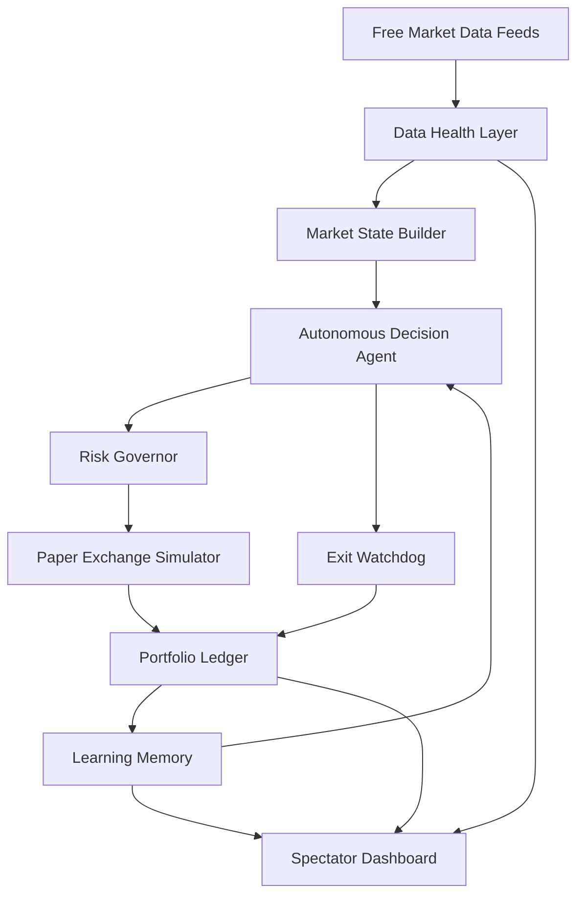

# Autonomous Paper Trading Agent

> A safe AI agent for market observation, simulated execution, and learning — **Kaggle AI Agents Capstone (Freestyle Track)**

`Paper Trading Only` · `Free APIs` · `Zero-Cost VPS` · `24/7 Autonomous` · `Fully Explainable`

---

## The Problem

Retail traders face three persistent challenges:

1. **Overtrading** — entering positions based on emotion, boredom, or fear of missing out rather than evidence.
2. **Missed setups** — no human can monitor multiple markets across multiple timeframes around the clock.
3. **Inconsistent risk discipline** — varying position sizes, moving stop losses, ignoring drawdown limits, and revenge trading after losses.

These problems are well-documented in behavioral finance research. Most retail traders lose money not because their strategy is fundamentally flawed, but because they cannot execute it consistently.

**This project asks:** can an autonomous agent system observe markets continuously, wait for statistically stronger setups, manage risk mathematically, explain every decision, and learn from outcomes — all without risking real capital?

---

## The Solution

An **autonomous paper-trading agent** that monitors 9 assets 24/7 using entirely free market data feeds:

| Asset Class | Assets | Data Sources |
|---|---|---|
| Crypto | BTC, ETH, SOL | Binance/Bybit WebSockets, Kraken OHLC, CoinGecko |
| Forex | EURUSD, GBPUSD, USDJPY | Yahoo Finance |
| Commodities | GOLD, OIL, SILVER | Yahoo Finance |

The system evaluates **multi-timeframe technical confluence** (1m, 5m, 15m, 1h, 4h), applies advanced indicators, manages risk through mathematical models, and records every decision with full explainability. All execution is simulated — **no real money is ever at risk**.

---

## Live Demo

> 🌐 **[https://trader.tejashendre.com](https://trader.tejashendre.com)**
>
> Public spectator dashboard — no login required. Read-only access to portfolio state, scan results, trade history, equity curve, and opportunity radar.

---

## Kaggle Capstone Concepts Demonstrated

| # | Kaggle Concept | Where | Description |
|---|---|---|---|
| 1 | **Agent / Multi-Agent System (ADK)** | `agents/trading_reviewer_agent.py` | Safety and explainability reviewer agent |
| 2 | **MCP Server** | `mcp/trading_mcp_server.ts` | Read-only Model Context Protocol server |
| 3 | **Antigravity** | Video demo (4:10–4:40) | Google Antigravity development workflow |
| 4 | **Security Features** | Spectator/Admin auth separation | Paper-only execution, read-only public access |
| 5 | **Deployability** | Docker Compose + Oracle VPS | One-command deployment with CI/CD pipeline |
| 6 | **Agent Skills (CLI)** | `scripts/agent-status.ts` | `agent:status`, `agent:explain`, `agent:audit` |

---

## Architecture



The system follows a continuous agent loop:

**Observe → Decide → Risk Check → Paper Execute → Monitor → Learn**

Each cycle runs autonomously. The daemon scans for entries every 60 seconds and monitors open positions every 5 seconds. The learning memory feeds back into future decisions, creating a closed-loop agent system.

---

## Agent Roles

### 1. Market Observer Agent
Fetches free market data from Binance/Bybit WebSockets, Kraken OHLC, Yahoo Finance, and CoinGecko. Normalizes candles across all timeframes (1m, 5m, 15m, 1h, 4h). Computes feed health scores and detects stale or degraded data. Blocks trading decisions when data quality is insufficient.

### 2. Decision Agent
Evaluates technical confluence across multiple timeframes. Computes indicators including SMA, EMA, RSI, MACD, Bollinger Bands, ATR, VWAP, Stochastic RSI, Market Structure detection, Order Blocks, Fair Value Gaps, Volume Spread Analysis, and RSI Divergences. Produces one of four decisions: **ENTRY**, **HOLD**, **SKIPPED**, or **BLOCKED** — each with full reasoning.

### 3. Risk Governor Agent
Validates every proposed trade against risk limits. Caps leverage, margin, and notional exposure. Enforces drawdown equity guards (25–75% size reduction during drawdowns). Applies sector concentration limits. Uses ATR-based stop placement adjusted by the Hurst Exponent. Sizes positions with Kelly Criterion.

### 4. Paper Execution Agent
Simulates order fills at current market prices. Records entries and exits with timestamps, prices, and sizing. Tracks PnL including simulated fees, slippage, and leverage costs. Writes all state to Redis for dashboard display.

### 5. Exit Watchdog Agent
Monitors all open positions every 5 seconds. Checks stop loss and take profit levels against live prices. Moves stops to breakeven when trades start working. Applies trailing stops to protect profit. Cuts losses at predetermined levels.

### 6. Learning Agent
Maintains an **Opportunity Journal** that tracks setups seen but not taken, recording what would have happened. The **Local Learning Memory** compares predicted vs actual outcomes and adjusts conviction multipliers for future decisions. This creates a feedback loop that makes the system more selective over time.

---

## Safety

> ⚠️ This system is **paper trading only** by design.

| Safety Feature | Implementation |
|---|---|
| No real money | `LIVE_TRADING_ENABLED=false` by default |
| No brokerage | No real exchange connection in production |
| Read-only public access | Spectator mode with `Bearer SPECTATOR` token |
| Admin separation | Mutations require separate admin authentication |
| Economic blackouts | FOMC, CPI, NFP, BOE, ECB events block new entries |
| Session enforcement | Forex entries require London+New York overlap |
| Drawdown protection | Automatic size reduction during equity drawdowns |

---

## Tech Stack

| Component | Technology |
|---|---|
| Frontend | Next.js 15, React 18, TypeScript |
| State | Redis (ioredis) |
| Containerization | Docker Compose (3 services) |
| Hosting | Oracle Cloud Free Tier VPS |
| Reverse Proxy | Nginx with SSL |
| CI/CD | GitHub Actions (lint + build + tsc + audit → SSH deploy) |
| Market Data | Binance WS, Bybit WS, Kraken OHLC, Yahoo Finance, CoinGecko |
| Charts | Lightweight Charts |
| Validation | Zod schemas |

---

## Local Setup

```bash
# 1. Install dependencies
npm install

# 2. Configure environment
cp .env.local.example .env.local
# Edit .env.local with your settings (Redis URL, secrets)

# 3. Start Redis
docker compose up -d redis

# 4. Start the dashboard (http://localhost:3000)
npm run dev

# 5. Start the autonomous trading daemon (separate terminal)
npm run daemon:swing
```

---

## Deployment

### Docker Compose (Production)

```bash
git pull origin main
docker compose down
docker compose up -d --build
docker compose ps
```

### Docker Services

| Service | Container | Port |
|---|---|---|
| Dashboard | `quant-dashboard` | 3000 |
| Swing Daemon | `quant-swing-daemon` | — |
| Redis | `quant-redis` | 6379 |

### Post-Deployment Verification

```bash
# Check logs
docker logs quant-swing-daemon --tail=100
docker logs quant-dashboard --tail=100

# Run deploy verifier
STATUS_URL=https://trader.tejashendre.com/api/user/status \
STATUS_AUTH_TOKEN=SPECTATOR \
sh scripts/vps-deploy-check.sh --expected-commit "$(git rev-parse --short HEAD)"
```

---

## MCP Server

The project includes a **read-only Model Context Protocol server** at `mcp/trading_mcp_server.ts`. It exposes portfolio state, scan results, system health metrics, and trade history over stdio JSON-RPC 2.0. No write operations are supported.

📖 See [`mcp/README.md`](../mcp/README.md) for setup and usage.

---

## ADK Reviewer Agent

A Python-based **safety and explainability reviewer agent** at `agents/trading_reviewer_agent.py`. It audits recent trade decisions for risk compliance, validates reasoning quality, and generates human-readable review reports. Read-only — it cannot modify system state.

📖 See [`agents/README.md`](../agents/README.md) for setup and usage.

---

## Agent CLI Skills

Three CLI commands provide agent-like interaction with the system:

```bash
# Portfolio status + system health summary
npm run agent:status

# Plain-English explanation of the latest scan decision
npm run agent:explain

# Full strategy audit report
npm run agent:audit
```

These demonstrate the **Agent Skills** Kaggle concept — structured CLI tools that query system state and produce formatted reports.

---

## Limitations

- **Free data feeds** can be stale, rate-limited, or temporarily unavailable.
- **Paper results differ from live execution** due to slippage, liquidity, spreads, and exchange behavior.
- **No profit guarantee** — no trading system can guarantee profitability.
- **One-minute scan interval** — this is swing trading, not high-frequency trading.
- **Forex/commodity data** may be slower or less complete than crypto data.
- **LLM APIs are optional** — the core system runs on deterministic math, not language models.

---

## Future Work

- **Real broker sandbox** — paper mode with live order book simulation (e.g., Alpaca, IBKR paper).
- **Stronger ML signal filtering** — local models trained on actual paper trade outcomes.
- **Formal evaluation pipeline** — backtesting with standard metrics (Sharpe, Sortino, max drawdown).
- **Per-setup performance analytics** — track which setup types perform best.
- **Real-time feed health alerts** — notifications when data quality degrades.
- **Multi-agent coordination** — agents that negotiate risk allocation across sectors.

---

## Validation

```bash
# Run all checks before shipping
npm run lint
npx tsc --noEmit
npm run build
npm run audit:strategy
```

---

> ⚠️ **Disclaimer**: This is an educational paper-trading simulation and research platform. It does not execute real-money trades, does not provide financial advice, and cannot guarantee profitability. Past simulated performance does not predict future results. Use at your own risk.
