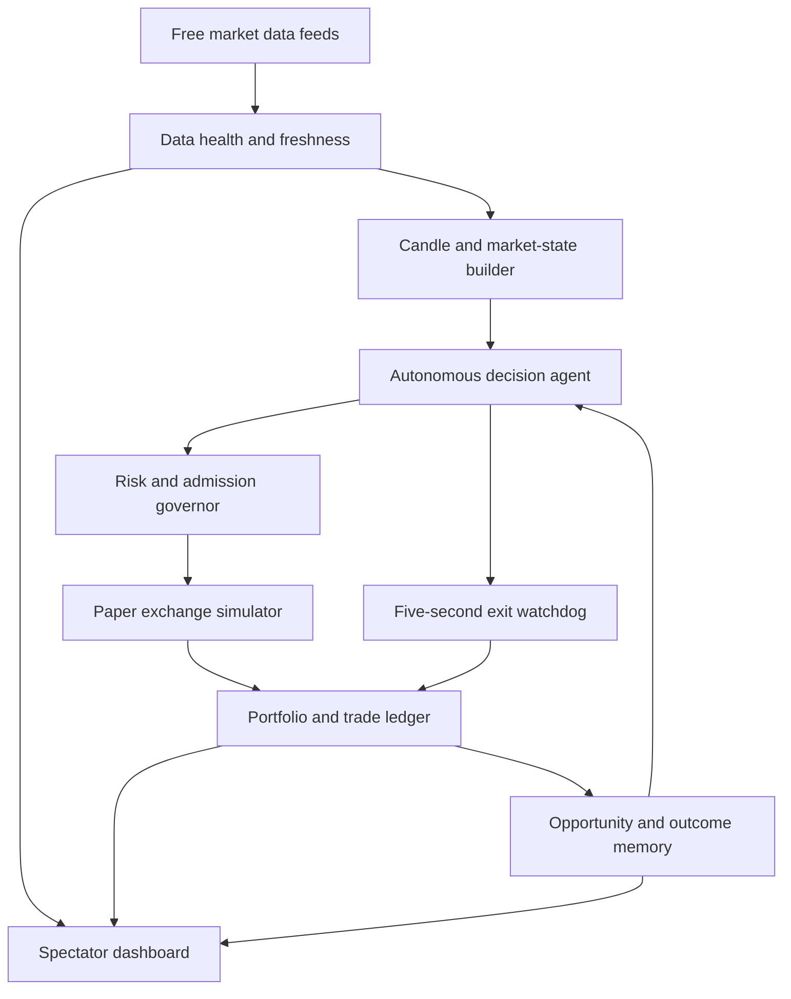

# Autonomous Paper Trading Agent

An explainable, autonomous paper-trading system for observing markets, evaluating multi-timeframe setups, simulating execution, managing exits, and learning from outcomes. It is designed as a free-tier research and demonstration project, not as a real-money trading service.

**Live spectator dashboard:** [trader.tejashendre.com](https://trader.tejashendre.com)
**Repository:** [tejashendre/AI-paper-trading-agent](https://github.com/tejashendre/AI-paper-trading-agent)
**Current architecture:** [docs/ARCHITECTURE.md](docs/ARCHITECTURE.md)
**Latest post-reset audit:** [docs/POST_RESET_SYSTEM_AUDIT_2026-07-29.md](docs/POST_RESET_SYSTEM_AUDIT_2026-07-29.md)

## What This Project Does

The system continuously watches nine assets, computes deterministic market signals, proposes entries only after data and risk checks, simulates fills and fees, monitors open positions, and records the reasoning and outcome of each decision.

| Asset class | Assets | Current data mode |
|---|---|---|
| Crypto | BTC, ETH, SOL | WebSocket prices with exchange OHLC fallback |
| Forex | EURUSD, GBPUSD, USDJPY | Free cached/periodic market data |
| Commodities | GOLD, OIL, SILVER | Free cached/periodic market data |

The core decision path does **not** depend on an LLM. Optional language-model features can explain or summarize decisions, but deterministic indicators, admission checks, simulated execution, and exits remain available when an LLM provider is unavailable or rate-limited.

## Current Operating Model

This is an autonomous **swing-trading simulator**, not an HFT engine.

- Entry scans run approximately every 60 seconds.
- The exit watchdog checks open positions approximately every 5 seconds.
- Crypto has the freshest market path because it uses WebSockets.
- Forex and commodities use slower free feeds and are treated as swing-only data.
- All balances, trades, fees, slippage, leverage, and P&L are simulated.
- Public viewers receive read-only spectator data; administrative mutations are separate.

The dashboard is a visibility layer, not proof of profitability. Current performance must be read from the live closed-trade ledger and its net metrics, not from a chart or an isolated open-position estimate.

## Architecture



The operating loop is:

**Observe -> validate data -> build state -> decide -> risk check -> simulate -> monitor -> learn**

### Main agents and services

1. **Market observer** normalizes candles and prices across assets and timeframes, reports feed freshness, and prevents low-quality data from silently becoming a trade signal.
2. **Decision agent** combines trend, momentum, volatility, volume, VWAP, market structure, and multi-timeframe confluence into an explainable `ENTRY`, `HOLD`, `SKIPPED`, or `BLOCKED` decision.
3. **Risk governor** controls margin, exposure, drawdown scaling, fee viability, and setup-specific sizing before an entry can be accepted.
4. **Paper exchange** simulates fills, fees, slippage, leverage effects, and realized/unrealized P&L.
5. **Exit watchdog** checks stop loss, take profit, breakeven, and trailing-protection rules independently of the slower entry scan.
6. **Learning memory** evaluates closed trades and watched opportunities chronologically. It can make a setup more selective, but it cannot silently rewrite history or promote a setup without evidence.
7. **Dashboard and CLI tools** expose the state, decisions, health, and explanations for human review.

## Auditable Risk Policy

Every autonomous entry passes the same admission path. The system is intentionally selective when the evidence does not show a usable edge.

| Control | Current behavior |
|---|---|
| Per-asset margin | Capped at 10% of equity |
| Total paper margin | Capped at 40% of equity |
| Degraded data | Slower feeds are swing-only and receive reduced sizing |
| Fee viability | The expected move must clear estimated round-trip fees and a minimum useful net result |
| Setup promotion | Requires later chronological evidence, positive expectancy, and a minimum profit-factor threshold |
| Drawdown response | Position sizing is reduced as equity drawdown increases |
| Winner protection | Trailing exits must preserve a useful net gain after fees |
| Kill behavior | Invalid, stale, unsafe, or overexposed proposals are blocked with a recorded reason |

The dashboard distinguishes **Observed**, **Caution**, and **Validated** setup states. A favorable price move alone is not treated as a profitable opportunity: learning uses net expectancy after costs and later validation where available.

## Explainability and Visibility

Each decision should answer:

- What asset and timeframe were evaluated?
- What data-health state was available?
- Which signals contributed to the score?
- Why was the trade admitted, held, skipped, or blocked?
- What entry, stop, target, size, fees, and expected move were used?
- How did the eventual exit affect net P&L?

The public dashboard prioritizes current portfolio state, closed AI performance, active positions, latest scan status, and plain-English reasons. Detailed diagnostics remain available through the authenticated/admin or developer surfaces rather than being required for every spectator.

## Safety and Scope

- Production configuration is paper-only. No real exchange order is submitted.
- No real-money profit is promised or implied.
- The free data sources can be delayed, rate-limited, incomplete, or temporarily unavailable.
- Paper fills do not reproduce live spreads, liquidity, queue position, or market impact.
- This project is not HFT. A one-minute entry scan and free delayed feeds cannot support institutional HFT claims.
- LLM providers are optional and may be unavailable; the deterministic trading path must remain the source of truth.
- Real brokerage execution, automatic leverage escalation, paid market-data feeds, and unsupervised live deployment are deliberately out of scope.

## Technology

| Layer | Technology |
|---|---|
| Application | Next.js, React, TypeScript |
| State and cache | Redis via ioredis |
| Runtime | Docker Compose |
| Hosting | Oracle Cloud Free Tier VPS |
| Public routing | Cloudflare proxy and Nginx |
| Market data | Crypto WebSockets plus free OHLC and cached feeds |
| Charts | Lightweight Charts |
| Validation | TypeScript, Zod, audit scripts |

## Local Development

```bash
npm install
cp .env.local.example .env.local
# Configure local Redis and non-secret development settings in .env.local.
docker compose up -d redis
npm run dev
```

Run the autonomous swing daemon separately when local testing requires it:

```bash
npm run daemon:swing
```

Never commit `.env.local`, API keys, SSH keys, admin tokens, Redis dumps, or private infrastructure details.

## Verification Commands

Run the relevant checks before publishing application changes:

```bash
npm run lint
npx tsc --noEmit
npm run build
npm run audit:strategy
npm run agent:audit
```

Run the live-window replay separately:

```bash
npm run replay:strategy
```

The replay reports engineering integrity and research quality independently. It
exits unsuccessfully when the strategy lacks at least 30 trades, positive
after-cost return, or a 1.10 profit factor; a mechanically correct losing replay
must not be treated as strategy approval.

Useful read-only CLI views:

```bash
npm run agent:status
npm run agent:explain
npm run agent:audit
```

## VPS Deployment

The canonical production host runs the checked-out project with Docker Compose. Deploy the intended commit and rebuild only the application services:

```bash
git pull --ff-only origin main
docker compose up -d --build quant-dashboard swing-daemon xsec-daemon
docker compose ps
```

Do not use `docker compose down` as a routine deployment step. It unnecessarily interrupts the stack and can create avoidable downtime. Redis and its persistent portfolio data should remain running unless an intentional maintenance procedure requires otherwise.

Typical service names:

| Service | Container | Purpose |
|---|---|---|
| Dashboard | `quant-dashboard` | Web UI and API |
| Swing daemon | `quant-swing-daemon` | Per-asset scan and exit process |
| Cross-sectional daemon | `quant-xsec-daemon` | Ranked long/short perp book, rebalanced every 12h |
| Redis | `quant-redis` | Runtime state and ledger persistence |

### Starting a strategy from a clean slate

Resetting is a deliberate step, never automatic on deploy. It zeroes both paper
portfolios and the cross-sectional book to the same capital on the same date so
the comparison between strategies means something, and it clears the learning
rules and journals derived from the previous strategy's trades.

```bash
docker compose exec quant-dashboard npm run reset:arena              # dry run: lists what would be cleared
docker compose exec quant-dashboard npm run reset:arena -- --confirm # apply
```

The execution ledger is preserved: a reset is recorded in it, not erased from it.

### Housekeeping

```bash
./scripts/vps-maintenance.sh --apply                                  # containers, images, build cache
docker compose exec quant-dashboard npm run redis:housekeeping        # stale Redis keys, dry run
```

Neither touches the `redis_data` volume, the `data/` directory, portfolios, or trade history.

After deployment, inspect logs and run the repository verifier from the VPS:

```bash
docker logs quant-swing-daemon --tail=100
docker logs quant-xsec-daemon --tail=100
docker logs quant-dashboard --tail=100
STATUS_URL=https://trader.tejashendre.com/api/user/status \
STATUS_AUTH_TOKEN=SPECTATOR \
sh scripts/vps-deploy-check.sh --expected-commit "$(git rev-parse --short HEAD)"
```

A healthy release requires commit agreement, healthy containers, a passing audit, advancing scans, fresh-enough feed samples, and repeated continuity checks. A green HTTP response alone is not enough.

## Read-Only Interfaces

The public spectator surface uses the read-only spectator authorization configured by the deployment. The primary status and price endpoints are:

```text
GET /api/user/status
GET /api/live-prices
```

Do not place credentials or bearer tokens in this README, screenshots, source control, or public video material.

## MCP and Reviewer Agent

The read-only MCP server is documented in [mcp/README.md](mcp/README.md). It does not expose trade mutation tools.

The ADK reviewer agent is documented in [agents/README.md](agents/README.md). It reviews decisions and risk explanations but cannot change portfolio state.

## Project Status

The project is a functioning free-tier paper-trading research platform with explicit limits and audit surfaces. It is not a guaranteed money-making system, a broker, or a substitute for professional financial infrastructure. Treat live dashboard performance as experimental evidence and keep the simulator in paper mode.

## License and Disclaimer

This project is intended for education, experimentation, and agent-system demonstration. Simulated performance is not predictive of future results. Nothing in this repository is financial advice. The authors accept no responsibility for trading or investment decisions made from this software.
