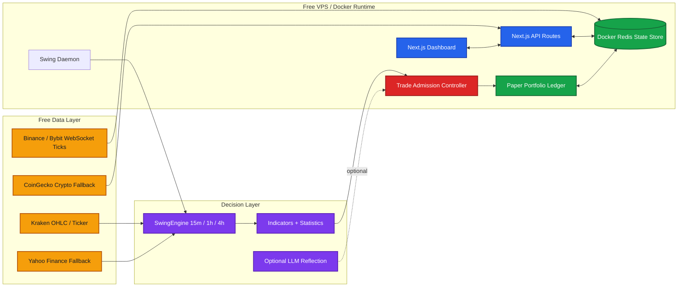

# Autonomous Quant Trading Agent

A free-first autonomous paper trading system built for selective, higher-timeframe swing trading. The system runs on a Next.js dashboard, a Node.js trading daemon, Docker Redis, and free market data fallbacks.

This project is intentionally **paper trading by default**. The goal is to test whether a deterministic math engine can wait for rare, high-confluence setups, size them safely, explain every action, and run continuously on a zero-cost VPS.

> This is research software, not financial advice. No trading system can guarantee profit or 100% accuracy.

---

## What The Bot Is Designed To Do

- Run 24/7 on a free VPS.
- Watch supported assets through free market data sources.
- Use 15m, 1h, and 4h candle structure to find stronger swing setups.
- Trade only when confluence passes the required score.
- Block oversized trades through a centralized risk admission controller.
- Simulate paper entries, exits, fees, leverage, margin, stop loss, and take profit.
- Work even when LLM APIs are missing, blocked, or rate-limited.
- Keep live trading disabled unless it is explicitly enabled.

The system is **not** designed to spam one-second scalps. It can consume fast price updates where free WebSocket data is available, checks active swing exits every 5 seconds, and keeps new entry decisions intentionally slower and more selective.

---

## Current Core Architecture



---

## How The Autonomous Loop Works

1. The daemon starts and connects the crypto WebSocket mesh for live price cache updates.
2. A fast exit watchdog checks active swing positions every 5 seconds.
3. If stop loss or take profit is hit, it closes the paper position.
4. If there is no open position for an asset, it scans for a new setup.
5. The `SwingEngine` pulls 15m, 1h, and 4h candles.
6. Technical indicators and statistics are computed locally.
7. A confluence score is produced.
8. If the score is too weak, the bot holds.
9. If the score is strong enough, the trade is sent to the `TradeAdmissionController`.
10. The risk controller sizes margin, leverage, notional exposure, fees, max loss, and portfolio exposure.
11. If approved, a paper trade is opened and written to Redis.
12. The dashboard reads Redis and displays the current portfolio, logs, trades, chart state, latest scan results, and no-trade reasons.

The current daemon entry scan interval is one minute. That is deliberate for this version because the strategy depends on higher-timeframe candles, not sub-second order flow. Active swing exits are monitored separately every 5 seconds.

---

## Important Safety Rules

- `LIVE_TRADING_ENABLED` must be `true` before any live exchange execution path can be used.
- Exchange API keys alone do not activate live trading.
- LLM keys are optional.
- Missing or failed LLM calls should not stop the math-first swing system.
- Each trade goes through margin and risk admission before opening.
- The system blocks duplicate active positions in the same asset.
- The system caps total portfolio margin exposure.
- Leverage is score-based, not fixed.
- Forex and commodity entries are blocked outside weekday market sessions to avoid stale weekend prices.

---

## Key Runtime Files

| Area | File |
| --- | --- |
| Dashboard | `src/components/Dashboard.tsx` |
| Main page | `src/app/page.tsx` |
| Status API | `src/app/api/user/status/route.ts` |
| Manual trade API | `src/app/api/trade/manual/route.ts` |
| Swing trade API | `src/app/api/trade/swing/route.ts` |
| Market data | `src/lib/market.ts` |
| Swing signal engine | `src/lib/swingEngine.ts` |
| Trading indicators | `src/lib/indicators.ts` |
| Statistical metrics | `src/lib/statistics.ts` |
| Risk admission | `src/lib/trading/tradeAdmission.ts` |
| Asset sizing and PnL | `src/lib/trading/assetSpecs.ts` |
| Portfolio state | `src/lib/portfolio.ts` |
| Redis state | `src/lib/redis.ts` |
| Swing daemon | `src/daemon/swingDaemon.ts` |
| WebSocket mesh | `src/daemon/websocketDataMesh.ts` |

---

## Local Development

```bash
npm install
cp .env.local.example .env.local
docker compose up -d redis
npm run dev
```

Start the autonomous swing daemon in a second terminal:

```bash
npm run daemon:swing
```

---

## VPS Deployment

```bash
git pull origin main
docker compose down
docker compose up -d --build
docker compose ps
```

Useful checks:

```bash
docker logs quant-swing-daemon --tail=100
docker logs quant-dashboard --tail=100
docker system df
```

---

## Environment

Use `.env.local.example` as the template.

Required:

- `DASHBOARD_SECRET`
- `ADMIN_SECRET`
- `REDIS_URL`

Optional:

- `GEMINI_API_KEY`
- `GROQ_API_KEY`
- `OPENROUTER_API_KEY`
- `SUPABASE_URL`
- `SUPABASE_SERVICE_ROLE_KEY`
- `TELEGRAM_BOT_TOKEN`
- `TELEGRAM_CHAT_ID`
- `BINANCE_API_KEY`
- `BINANCE_SECRET_KEY`
- `BYBIT_API_KEY`
- `BYBIT_SECRET_KEY`

Safety:

```env
LIVE_TRADING_ENABLED=false
```

Keep this false for paper trading.

---

## Current Strategy Philosophy

The system should prefer **no trade** over a weak trade.

Good behavior means:

- many cycles with no entry,
- clear reasons for blocked trades,
- rare entries with stronger confluence,
- small controlled loss when wrong,
- larger planned reward than risk,
- stable operation without depending on paid APIs.

A bot that waits days or weeks for a better swing setup may be behaving correctly. The objective is not activity; the objective is disciplined selection.

---

## Known Constraints

- Free data is useful but not institutional-grade.
- Forex and commodity data may be slower or less complete than crypto data.
- WebSocket coverage is strongest for crypto.
- One-minute scanning is not real HFT.
- Paper results can differ from real execution due to slippage, liquidity, spreads, and exchange behavior.
- LLM APIs can be rate-limited, unavailable, or return invalid data, so they must remain optional.

---

## Validation

Before shipping changes:

```bash
npm run lint
npx tsc --noEmit
npm run build
```

For Docker:

```bash
docker compose up -d --build
docker compose ps
```

---

## Project Direction

The next best upgrades are:

- Per-position exit watchdog refinements and feed-health alerts.
- Per-setup performance analytics.
- Trade-quality memory from real completed paper trades.
- More transparent dashboard explanations.
- Better feed health scoring.
- Local ML filter trained only on actual trade outcomes.
- Strict cooldowns after losing streaks or bad market regimes.

The foundation is now a clean autonomous swing system. The next goal is to make every trade more selective, more explainable, and easier to audit.
