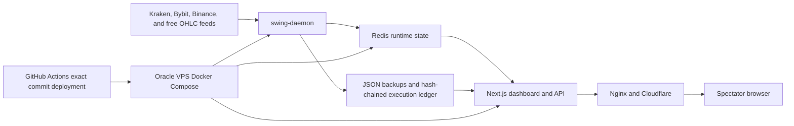
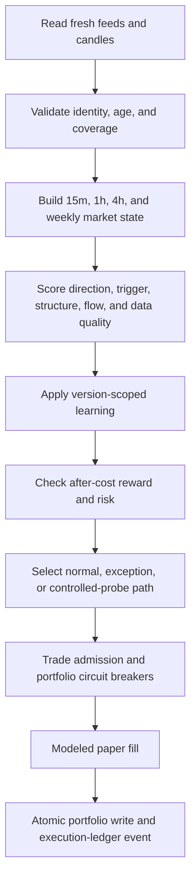

# Autonomous Paper Trading Agent Architecture

## Operating Contract

This repository runs a deterministic, explainable, paper-only swing trading
system. It is not an HFT engine, a broker integration, or evidence of a
profitable strategy.

The production contract is:

- Scan nine assets for swing entries approximately once per minute.
- Monitor open positions approximately every five seconds.
- Use deterministic signals and admission rules as the trading source of truth.
- Simulate fills, spread, slippage, fees, carry, leverage, and P&L.
- Fail closed when data, accounting, exposure, or strategy evidence is unsafe.
- Keep optional LLM output outside the critical execution path.
- Expose read-only production state to spectators and reserve mutations for
  authenticated operators.

## Production Topology



Docker Compose owns three required services:

| Service | Container | Responsibility |
|---|---|---|
| Dashboard | `quant-dashboard` | Next.js UI and authenticated API |
| Trading daemon | `quant-swing-daemon` | Single writer for scans, entries, exits, and learning |
| State | `quant-redis` | Runtime cache, locks, portfolios, logs, and current learning |

The dashboard must never become a second execution writer. Manual scan requests
are handed to the daemon so that all entries pass the same accounting, risk, and
ledger path.

## Runtime Loops

### Entry Loop



The engine can return `HOLD` even with high conviction when a required path is
incomplete. Diagnostics must name the first real blocker; the phrase
`all entry gates passed` is valid only when a complete entry path is satisfied.

### Exit Loop

The five-second watchdog evaluates hard stops and targets before any stop repair
or trailing logic. It can also protect a fee-aware winner or close a position
whose live thesis is invalidated. Every close is reconciled against cash,
position state, modeled costs, and the execution ledger.

## Market Data

| Asset class | Assets | Price path | Candle path | Trading treatment |
|---|---|---|---|---|
| Crypto | BTC, ETH, SOL | Kraken, Bybit, and Binance public WebSockets | Exchange OHLC with fallback | `REALTIME_FAST`; two fresh independent prices required for fast admission |
| Forex | EURUSD, GBPUSD, USDJPY | Free periodic provider | Free OHLC provider | `SLOW_SWING`; reduced sizing and wider freshness tolerance |
| Commodities | GOLD, OIL, SILVER | Free periodic provider | Free OHLC provider | `SLOW_SWING`; reduced sizing and market-session awareness |

Feed health and execution freshness are different concepts. A connected socket
is not sufficient: the daemon checks recent message timestamps and independent
price agreement. When a fast source expires, the engine falls back or blocks
instead of treating old WebSocket state as executable.

Charts display OHLC candles and a separate latest price. A candle timestamp is
the start of its interval, not the time of the newest tick. The browser chooses
the closest supported local timezone on first load and persists an explicit
user selection.

## Decision and Risk Layers

The swing engine combines:

- continuous higher-timeframe trend evidence;
- short-term confirmation;
- market structure and liquidity state;
- crypto order-book and funding flow where available;
- data quality and live-price displacement;
- reachable take-profit distance;
- after-cost net reward/risk;
- strategy-version-scoped learning.

The admission controller then applies:

- directionally valid stop and target geometry;
- after-cost expected-capture viability;
- per-asset and total margin caps;
- risk-at-stop sizing;
- leverage and margin-mode limits;
- drawdown, daily-loss, turnover, duplicate, and correlation guards;
- accounting reconciliation;
- learning quarantine and controlled recovery rules.

`STRONG` is a paper sizing mode, not a quality claim. It is available only to
high-conviction crypto candidates with real-time data, non-negative learning,
and every downstream portfolio guard still active.

## State and Persistence

Redis contains active runtime state and lock ownership. Local JSON backups
provide atomic recovery for portfolios and trade history. The execution ledger
records hash-chained events for tamper-evident verification.

An intentional empty trade list is valid after reset. Recovery code must not
misclassify an empty array as corruption.

Optional Supabase trade mirroring remains isolated from the critical path. The
daemon must continue to trade in paper mode when Supabase or any LLM provider is
disabled.

## Reset and Learning Semantics

An admin reset:

1. Closes or removes current paper positions according to the reset path.
2. Restores the selected paper portfolios to their configured initial capital.
3. Clears current-strategy learning, opportunity evaluations, and trade reviews.
4. Preserves older strategy-version records only for audit history.
5. Records reset provenance.

Old strategy outcomes do not automatically become active rules after reset.
Current rules are rebuilt from new watched opportunities and closed trades under
the exact current strategy version. This prevents legacy losses or wins from
silently governing a materially different strategy.

## Research and Release Gates

Engineering correctness and strategy quality are separate gates.

### Engineering Integrity

- deterministic strategy audit passes;
- typecheck, lint, and production build pass;
- replay uses modeled fills and exact fee accounting;
- stale windows cannot create trades;
- execution and portfolio ledgers reconcile;
- current scan and feed health advance in production.

### Research Quality

A replay is not research-valid merely because execution code ran. Candidate
promotion requires at least:

- 30 closed replay trades;
- positive net return after modeled fills, fees, and carry;
- profit factor of at least 1.10.

Even a passing replay is only a candidate result. Production edge requires
walk-forward evidence and a new post-release paper cohort. The operational
system can be healthy while profitability remains unproven.

## Authentication and Public Surface

`verifyAuth()` accepts explicit bearer tokens only:

- dashboard administrator token for operator actions;
- `SPECTATOR` for the bounded read-only GET allowlist;
- cron/daemon secret for approved machine actions.

Infrastructure-specific headers are not trusted. Secrets, SSH keys, Redis
dumps, environment files, and VPS origin details must remain outside Git.

Primary spectator endpoints:

```text
GET /api/user/status
GET /api/live-prices
GET /api/chart
GET /api/signals
```

## Deployment and Verification

GitHub Actions checks out one commit, runs lint/build/typecheck/audits, creates a
runtime source manifest, and deploys that exact SHA to the Oracle VPS. The
workflow preserves Redis, creates a pre-deploy backup, rebuilds application
containers, and waits for health and scan advancement.

A release is verified only when all of these agree:

- GitHub main SHA;
- deployed API commit metadata;
- VPS checkout SHA;
- runtime source manifest;
- healthy Compose services;
- advancing scan IDs;
- fresh-enough feed samples;
- no new daemon or dashboard errors.

## Deliberately Removed or Excluded

- The former `agent/optimize` endpoint was removed because it wrote random
  parameter drift that the strategy never consumed, attempted to call a
  nonexistent Python worker, and advertised optimization without research
  evidence.
- Real exchange order placement is excluded.
- Automatic threshold relaxation to create more trades is excluded.
- Rust or Python migration is deferred until profiling identifies a real
  throughput or numerical bottleneck. Free public feeds and a one-minute scan
  remain the limiting factors, not TypeScript execution speed.

## Source of Truth

| Concern | Primary implementation |
|---|---|
| Market feeds and candles | `src/lib/market.ts`, `src/lib/data/websocketDataMesh.ts` |
| Signal and entry paths | `src/lib/swingEngine.ts` |
| Admission and margin | `src/lib/trading/tradeAdmission.ts` |
| Execution costs | `src/lib/trading/executionCostModel.ts` |
| Portfolio budgets | `src/lib/trading/portfolioRiskBudget.ts`, `src/lib/trading/portfolioGuards.ts` |
| Learning | `src/lib/trading/localLearning.ts`, `src/lib/trading/opportunityJournal.ts`, `src/lib/trading/tradeReviewJournal.ts` |
| Runtime writer | `src/daemon/swingDaemon.ts` |
| Replay and research | `src/lib/backtest/replayEngine.ts`, `src/lib/research/walkForward.ts` |
| Deployment | `docker-compose.yml`, `.github/workflows/deploy.yml`, `scripts/vps-deploy-check.sh` |
