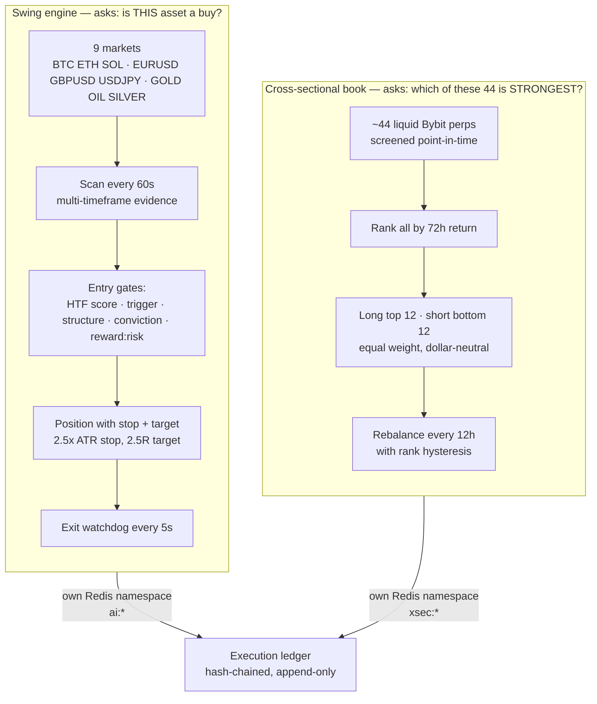
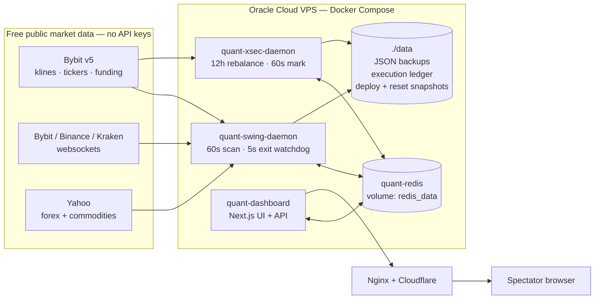
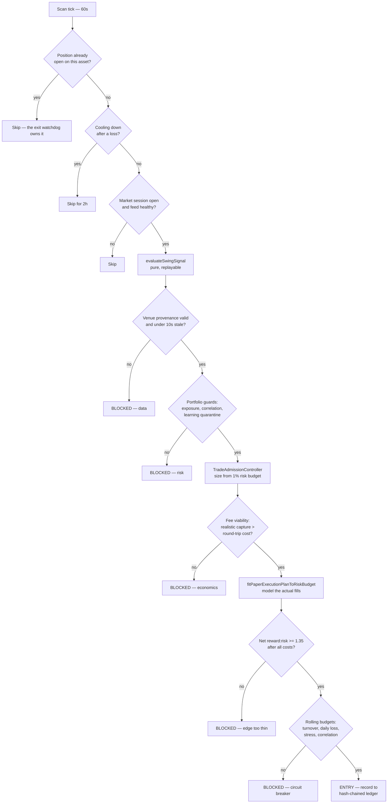
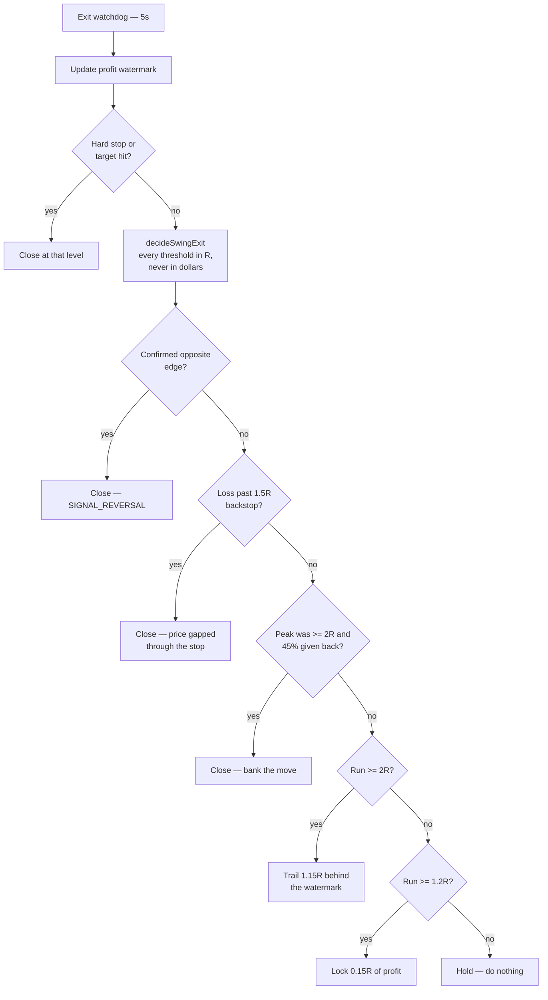
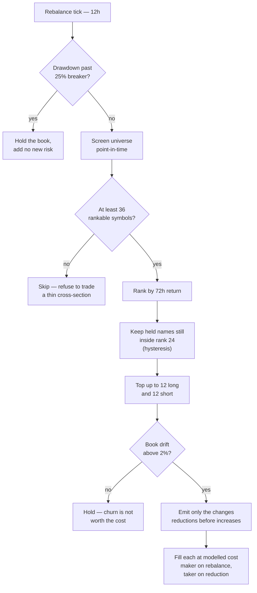
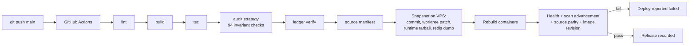

# Autonomous Paper Trading Agent — Architecture

**Last verified:** 2026-08-26 against the deployed stack at trader.tejashendre.com

## Operating contract

This repository runs a deterministic, explainable, **paper-only** trading
system. It is not an HFT engine, not a broker integration, and not evidence of
a profitable strategy.

- Two independent strategies run side by side, each with its own $10,000 paper
  account, so they can be compared without either being able to corrupt the
  other.
- Every fill is simulated through one cost model: spread, size-dependent
  slippage, stop-gap risk, maker/taker fees and funding carry.
- Every risk limit fails closed. When data, accounting, exposure or strategy
  evidence is unsafe, the system declines to trade rather than guessing.
- No API keys. Every market data source used here is a free public endpoint.

## The two strategies

The system asks two different questions, and the difference is the whole point.



**Why two.** The swing engine alone cannot be profitable: its round-trip cost
is 14–22 bps and its measured forward edge is 7–12 bps. It pays more to trade
than the signal is worth. The cross-sectional book solves this by ranking
assets against each other — but only works with breadth. Over BTC/ETH/SOL alone
the same method is a *statistically significant loser* (t = −2.69); over ~44
markets it returns +96% in a 12-month replay. See
[CROSS_SECTIONAL_MOMENTUM_2026-08-25.md](./CROSS_SECTIONAL_MOMENTUM_2026-08-25.md).

## Runtime topology



Request budget is deliberately tiny. One `tickers` call returns the price and
turnover of every perpetual at once; momentum needs one `kline` call per symbol
per rebalance. At a 12-hour cadence over ~50 symbols that is roughly a hundred
requests a day, far inside free rate limits.

## How a swing trade is decided

Every gate below can veto. The order matters: cheap checks run before expensive
ones, and provenance is verified before any sizing happens.



## How an open swing position is managed

One function owns every exit decision. This is the part that was most broken:
six guards used to race each other every sweep, each with absolute dollar
thresholds, and the tightest one always won.



**Weak opposing evidence never moves the stop.** It is recorded for the
dashboard and blocks scale-ins, but only a *confirmed* opposite edge closes a
trade. The previous behaviour — tightening to 0.35% of price on any opposing
signal — stopped trades out inside ordinary crypto noise.

## How the cross-sectional book rebalances



Hysteresis is not cosmetic. Without it the book replaces ~89% of its notional
every rebalance purely because names shuffle around the cut-off; with it, ~27%.
The gap *widens* as costs rise, which is exactly the robustness worth buying.

## Deployment and safety



**A push to `main` deploys straight to production.** There is no staging step.
The gates above are what make that safe — they have already refused one bad
release, and the snapshot means any deploy is reversible.

Two manual workflows sit alongside it, both dry-run by default:

| Workflow | Purpose |
|---|---|
| `Reset Paper Trading Arena` | Zero all three portfolios to the same capital on the same date. Snapshots Redis first, stops the daemons so a mid-scan save cannot resurrect old state. Requires typing `RESET`. |
| `VPS Maintenance` | Reclaim Docker disk, or restore a portfolio from any snapshot. The restore scans backwards for one that still holds trade history rather than blindly taking the newest. |

## Where state lives

| Namespace | Owner | Contents |
|---|---|---|
| `ai:*` | swing daemon | portfolio, trades, signals |
| `user:*` | manual entry via dashboard | portfolio, trades |
| `xsec:*` | cross-sectional daemon | book portfolio, fills, rebalance snapshot, live equity |
| `swing:*` | swing daemon | scan snapshot, cooldowns, lifetime counters |
| `perp:*` | cross-sectional daemon | ticker and kline caches, all TTL'd |
| `learning:<version>:*` | both | rules derived from closed trades, namespaced by strategy version |
| `./data` | both | JSON backups, hash-chained execution ledger, deploy and reset snapshots |

The three portfolios are deliberately separate accounts. The dashboard reports
them separately for the same reason — summing two independent $10,000 accounts
would misrepresent the comparison against the human portfolio.

## Reading the dashboard

| Panel | Scope | What "healthy" looks like |
|---|---|---|
| AI Trading Agent card | both strategies, broken out | swing and book P&L shown on separate lines |
| Cross-Sectional Book | book only | 24 positions, 12L/12S, net exposure near 0%, gross ~1.0x |
| Autonomous Swing Scan | swing only | scan counter advancing every ~60s |
| Swing Engine NLV / Balances / Performance | **swing only** | labelled as such; the book is not included |
| Terminal telemetry | both | `[SWING SCAN]` every 60s, `[XSEC] rebalance` every 12h |

Long quiet stretches are normal. The book rebalances twice a day; the swing
engine is designed to decline most setups. "Nothing changed since I last
looked" is usually correct behaviour, not a fault.

Genuine fault signals: book positions at 0 past a rebalance window, net
exposure drifting past ±10%, a frozen scan counter, or `[XSEC]` errors in
telemetry.

## Verifying any claim in this repository

Nothing here asks to be taken on trust:

```bash
npm run replay:xsec        # cross-sectional book over 12 months of Bybit history
npm run replay:strategy    # swing engine, same cost model
npm run audit:strategy     # 94 invariant checks, also gates every deploy
npm run ledger:verify      # hash chain integrity
```

## What this system does not claim

A 12-month replay showing Sharpe 2.76 will not repeat live. Backtested Sharpe
is almost always optimistic, the sample covers one regime, and a look-ahead
bias had to be corrected mid-study before the number could be trusted at all.
Treat the direction and the robustness as the finding, and the magnitude as a
ceiling. Whether the strategy earns its keep is a question only forward time
answers.
