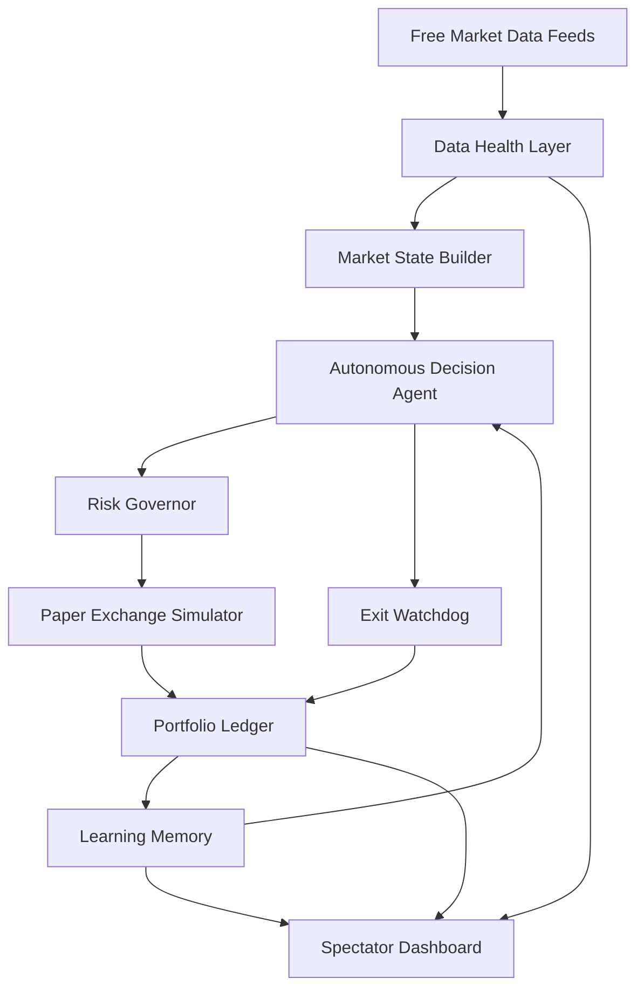

# Autonomous Paper Trading Agent Architecture

## System Overview

The Autonomous Paper Trading Agent is designed as a multi-agent system that simulates human discretionary trading logic without the emotional pitfalls. It uses free market data APIs to observe conditions across 9 assets, evaluates confluence on multiple timeframes, manages simulated risk, and learns from its outcomes.

## Agent Loop

## Agent Roles

### 1. Market Observer Agent
**Responsibility:**
- Fetches free public market data.
- Normalizes candles.
- Detects stale or degraded data.
- Feeds clean market state into the decision system.

### 2. Decision Agent
**Responsibility:**
- Evaluates technical confluence (Indicators, Market Structure, Divergences).
- Decides `ENTRY`, `HOLD`, `SKIPPED`, or `BLOCKED`.
- Explains why a trade was or was not taken.

### 3. Risk Governor Agent
**Responsibility:**
- Prevents reckless position sizing using Kelly Criterion.
- Caps leverage and margin.
- Enforces drawdown rules (reduces position size during losing streaks).
- Blocks trades during unsafe data conditions or macro blackout windows.

### 4. Paper Execution Agent
**Responsibility:**
- Simulates order execution.
- Records entry/exit.
- Tracks realized and unrealized P&L.
- Separates AI portfolio from Human portfolio.

### 5. Exit Watchdog Agent
**Responsibility:**
- Monitors active positions continuously.
- Protects profit (trailing stops).
- Cuts invalidated trades.
- Avoids leaving positions unmanaged.

### 6. Learning Agent
**Responsibility:**
- Records watched opportunities.
- Compares later outcomes.
- Learns which setups are helpful or dangerous.
- Adjusts future confidence.
