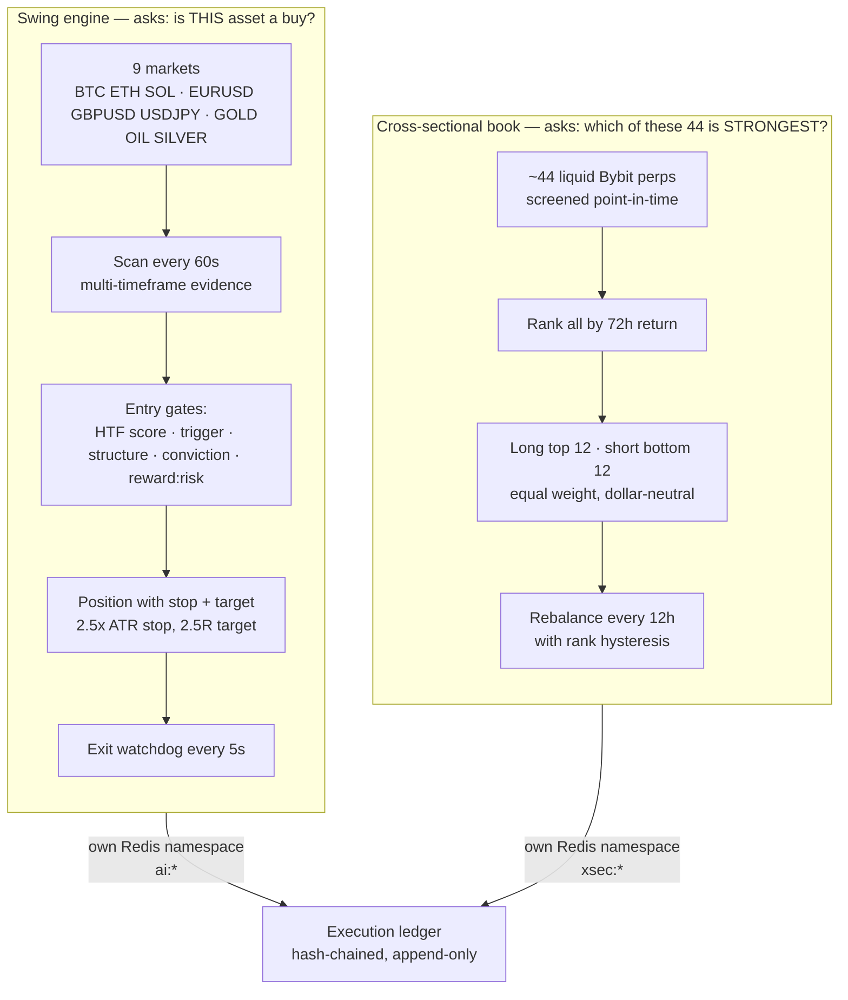
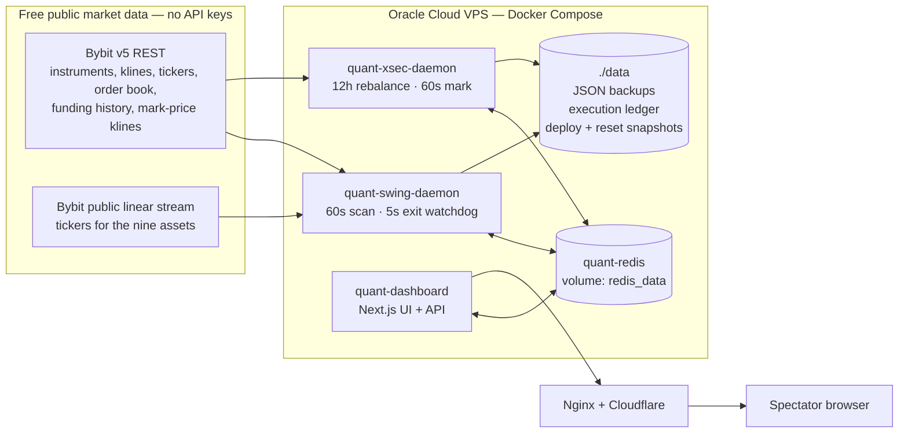
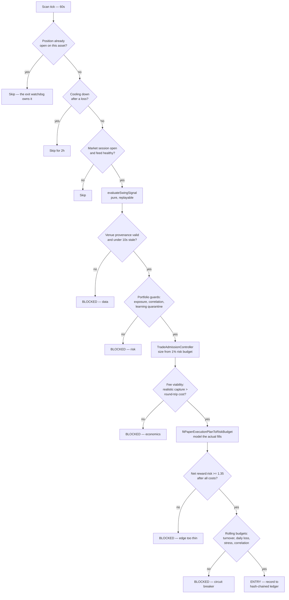
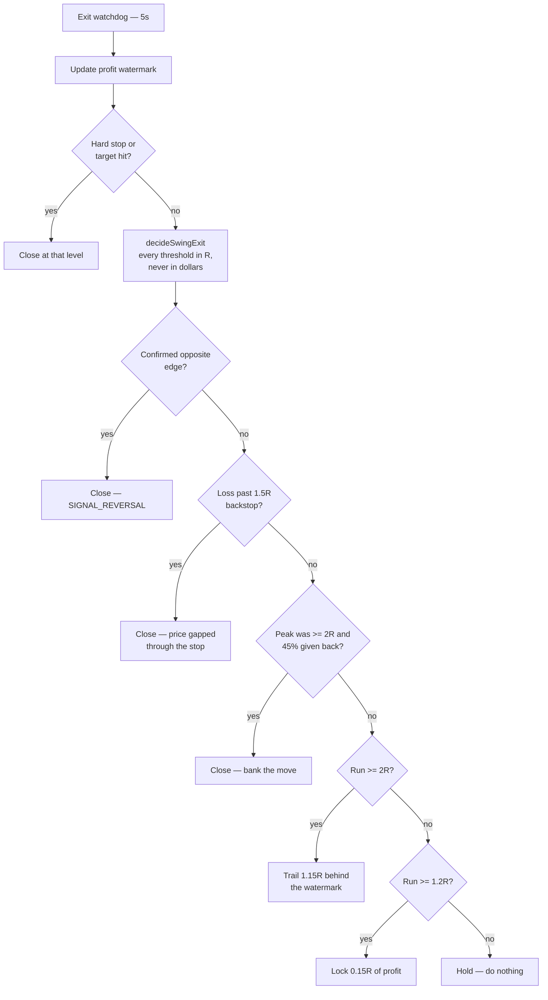
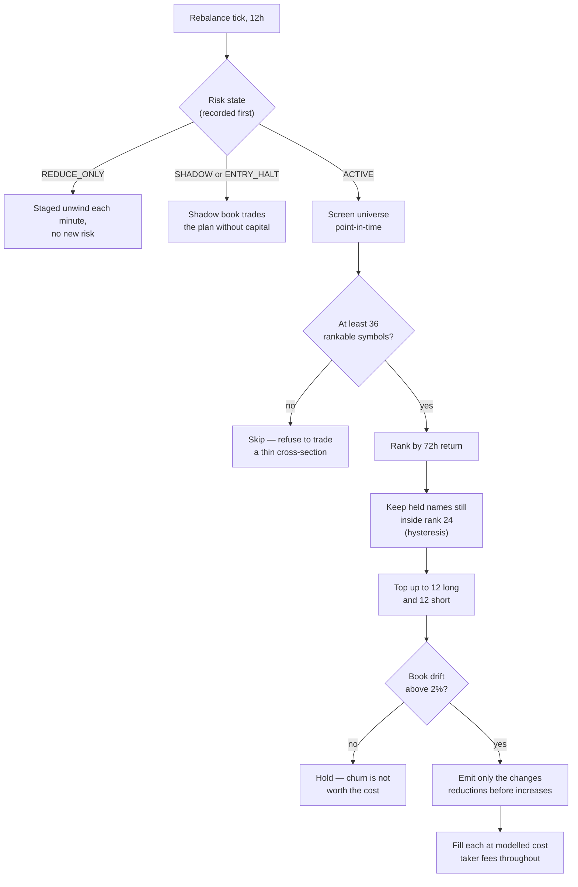
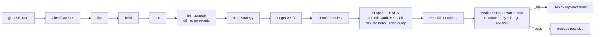

# Autonomous Paper Trading Agent — Architecture

**Last runtime verification:** 2026-10-01, Release A commit `191761f`.

**Remaining complete release, 2026-10-01:** branch `codex/bybit-complete-upgrade`
adds closed-bar trend/range routing, instrument-scoped learning, preregistered
research reviews, bounded compressed capture and direct browser quotes.
Release A is deployed; this branch awaits its final reviewed rollout. Steps:
[BYBIT_ALL_ASSETS_ROLLOUT_RUNBOOK.md](./BYBIT_ALL_ASSETS_ROLLOUT_RUNBOOK.md).

## Operating contract

The remaining release uses trend pullback as the guarded baseline and range
reversion as SHADOW research. A neutral 4h ADX zone produces no family
candidate. Every candidate records instrument, family, config, regime and
closed feature cutoff. Existing baseline admission, costs, leverage and risk
caps still apply. All nine assets are evaluated; no setup is a valid result.

Learning requires at least 15 independent completed positions with matching
instrument/data/family/regime/direction/strategy/config/cost/risk identity.
Rules expire after seven days, use fractional returns and net R, and affect
conviction by at most four points. They can reduce risk but cannot raise
leverage or approved capital. Old pooled summaries remain descriptive.

Research preregisters two baseline families per instrument and at most one
alternate per family/instrument cycle. Reviews require 30/10/10 chronological
folds with row and time embargoes, nonoverlapping feature/label windows,
positive lower block-bootstrap net expectancy, full attempted-trial Sharpe
correction, nonnegative doubled-cost stress, verified fees and at least 15
independent forward shadow completions over 14 days. PAPER_ACTIVE requires a
human-authorized release. No automatic tuning or risk promotion occurs.
The Sharpe null-variance approximation is documented in deflatedSharpe.ts;
it is a screening statistic, not a probability of future profit.

The existing daemon captures closed 15m/1h/4h/W bars and periodic quote,
depth and funding summaries at most once per asset per 15 minutes. gzip
evidence hashes and cursors prevent repeated bar copies. The configurable
research budget defaults to 1 GiB; capture stops visibly when full and does
not delete financial history. `research:capture` and `research:replay` require
explicit local paths and do not access accounts. Captured bar replay is
descriptive: it lacks intrabar watchdog, scale-in and baseline reversal
parity, and does not fabricate unavailable historical costs.

The dashboard uses one public Bybit socket for nine ticker and trade topics,
latest-state rendering at up to 10 Hz, one-second REST recovery when needed,
bounded reconnect delay and cleanup for hidden tabs. No browser tick archive
or model service is added. Quotes, closed-bar quality, research evidence and
entry permission appear separately. Strategy scans remain one minute and
exit checks five seconds.

This repository runs a deterministic, explainable, **paper-only** trading
system. It is not an HFT engine, not a broker integration, and not evidence of
a profitable strategy.

- Two independent strategies run side by side, each with its own $10,000 paper
  account, so they can be compared without either being able to corrupt the
  other.
- Every fill is simulated through one cost model: spread, size-dependent
  slippage, stop-gap risk and taker fees from a versioned schedule per asset
  class. Funding is booked from Bybit's published settlements at each funding
  boundary, once per position and boundary, never from an estimate.
- Every risk limit fails closed. When data, accounting, exposure or strategy
  evidence is unsafe, the system declines to trade rather than guessing.
- No API keys. Every market data source used here is a free public endpoint.

## The two strategies

The system asks two different questions, and the difference is the whole point.


```mermaid
flowchart TB
    subgraph SWING["Swing engine — asks: is THIS asset a buy?"]
        direction TB
        S1["9 markets<br/>BTC ETH SOL · EURUSD GBPUSD USDJPY · GOLD OIL SILVER"]
        S2["Scan every 60s<br/>multi-timeframe evidence"]
        S3["Entry gates:<br/>HTF score · trigger · structure · conviction · reward:risk"]
        S4["Position with stop + target<br/>2.5x ATR stop, 2.5R target"]
        S5["Exit watchdog every 5s"]
        S1 --> S2 --> S3 --> S4 --> S5
    end

    subgraph XSEC["Cross-sectional book — asks: which of these 44 is STRONGEST?"]
        direction TB
        X1["~44 liquid Bybit perps<br/>screened point-in-time"]
        X2["Rank all by 72h return"]
        X3["Long top 12 · short bottom 12<br/>equal weight, dollar-neutral"]
        X4["Rebalance every 12h<br/>with rank hysteresis"]
        X1 --> X2 --> X3 --> X4
    end

    SWING -->|"own Redis namespace<br/>ai:*"| LEDGER["Execution ledger<br/>hash-chained, append-only"]
    XSEC -->|"own Redis namespace<br/>xsec:*"| LEDGER
```

**Why two.** The swing engine alone cannot be profitable: its round-trip cost
is 14–22 bps and its measured forward edge is 7–12 bps. It pays more to trade
than the signal is worth. The cross-sectional book solves this by ranking
assets against each other — but only works with breadth. Over BTC/ETH/SOL alone
the same method is a *statistically significant loser* (t = −2.69); over ~44
markets it returns +96% in a 12-month replay. See
[CROSS_SECTIONAL_MOMENTUM_2026-08-25.md](./CROSS_SECTIONAL_MOMENTUM_2026-08-25.md).

## Runtime topology


```mermaid
flowchart LR
    subgraph FREE["Free public market data — no API keys"]
        BYBIT["Bybit v5 REST<br/>instruments, klines, tickers, order book,<br/>funding history, mark-price klines"]
        WS["Bybit public linear stream<br/>tickers for the nine assets"]
    end

    subgraph ORACLE["Oracle Cloud VPS — Docker Compose"]
        SWINGD["quant-swing-daemon<br/>60s scan · 5s exit watchdog"]
        XSECD["quant-xsec-daemon<br/>12h rebalance · 60s mark"]
        DASH["quant-dashboard<br/>Next.js UI + API"]
        REDIS[("quant-redis<br/>volume: redis_data")]
        FILES[("./data<br/>JSON backups<br/>execution ledger<br/>deploy + reset snapshots")]
    end

    BYBIT --> SWINGD
    BYBIT --> XSECD
    WS --> SWINGD

    SWINGD <--> REDIS
    XSECD <--> REDIS
    DASH <--> REDIS
    SWINGD --> FILES
    XSECD --> FILES

    DASH --> NGINX["Nginx + Cloudflare"] --> USER["Spectator browser"]
```

Request budget is deliberately tiny. One `tickers` call returns the price and
turnover of every perpetual at once; momentum needs one `kline` call per symbol
per rebalance. At a 12-hour cadence over ~50 symbols that is roughly a hundred
requests a day, far inside free rate limits.

### Which feed serves which asset, and why

| Asset class | Assets | Feed | Instrument |
|---|---|---|---|
| Crypto | BTC, ETH, SOL | Bybit v5 | `BTCUSDT`, `ETHUSDT`, `SOLUSDT` |
| Commodities | GOLD, OIL, SILVER | Bybit v5 | `XAUUSDT`, `CLUSDT`, `XAGUSDT` |
| Forex | EURUSD, GBPUSD, USDJPY | Bybit v5 | `EURUSDUSDT`, `GBPUSDUSDT`, `USDJPYUSDT` |

Since Release A every asset reads one venue, Bybit's linear USDT perpetuals,
for prices, candles, depth, contract metadata and funding. Each position freezes
the contract it was opened on (for example `BYBIT_LINEAR_USDT_V1:USDJPYUSDT`), so
its P&L always uses the economics it was entered under; positions opened before
the upgrade keep their legacy model and are not scaled into. With one venue there
is no second source to cross-check a bad print, so the entry gate instead
requires validated venue metadata, a quote under 10 seconds old on every field
it uses, at most 2 seconds in the future, and 100 completed 15m, 1h and 4h bars.
Bybit has not confirmed the fee schedule for the three FX contracts, so they are
costed at a higher stress rate and their results cannot be promoted.

Commodities are priced from a crypto venue, which is not the obvious choice, so
the reason is worth stating. They were on Yahoo's CME futures until 2026-09-07,
where the intraday candles ran about ten hours behind while the quote stayed
current. Indicators are computed from candles and marks are taken from quotes,
so the price was right and the signal was not, and the swing engine correctly
refused to scan. The commodity sleeve was silently idle. The Bybit contracts
return complete 15m, 1h and 4h series with no gaps and no zero-volume bars.

`OIL` is WTI (`CLUSDT`), not Brent. Bybit lists Brent as `BZUSDT`, but WTI turns
over roughly three times as much and WTI is what this system has always meant by
oil. `strategy-audit.ts` names every expected mapping, so oil quietly becoming
Brent fails before it reaches a book.

**Routing follows the instrument, not the asset class.** Three behaviours key
off `bybitLinearSymbol` rather than `category`:

- **Data source.** Every configured asset reads its Bybit linear contract; no active path falls back to another venue.
- **Session hours.** The contracts trade around the clock, so none is marked closed. TradFi underlyings carry liquidity windows and weekend warnings, and outside peak hours an entry needs higher conviction.
- **Staleness tolerance.** Every series is a continuously quoted contract and is held to 2.5x its bar interval. Signals read completed bars only; the bar still forming is ignored.

Category still governs *risk* treatment, where "is this a commodity" remains the
right question: commodity leverage stays capped at 3x against crypto's 5x.

Feed status for every asset is public at `/api/health/feeds`, because a stale
feed does not announce itself: one stale timeframe rejects the whole scan for an
asset, and nothing in the portfolio view distinguishes "found no setup" from
"could not look".

## How a swing trade is decided

Every gate below can veto. The order matters: cheap checks run before expensive
ones, and provenance is verified before any sizing happens.


```mermaid
flowchart TB
    A["Scan tick — 60s"] --> B{"Position already<br/>open on this asset?"}
    B -->|yes| SKIP["Skip — the exit watchdog owns it"]
    B -->|no| C{"Cooling down<br/>after a loss?"}
    C -->|yes| SKIP2["Skip for 2h"]
    C -->|no| D{"Market session open<br/>and feed healthy?"}
    D -->|no| SKIP3["Skip"]
    D -->|yes| E["evaluateSwingSignal<br/>pure, replayable"]
    E --> F{"Venue provenance valid<br/>and under 10s stale?"}
    F -->|no| BLOCK1["BLOCKED — data"]
    F -->|yes| G{"Portfolio guards:<br/>exposure, correlation,<br/>learning quarantine"}
    G -->|no| BLOCK2["BLOCKED — risk"]
    G -->|yes| H["TradeAdmissionController<br/>size from 1% risk budget"]
    H --> I{"Fee viability:<br/>realistic capture ><br/>round-trip cost?"}
    I -->|no| BLOCK3["BLOCKED — economics"]
    I -->|yes| J["fitPaperExecutionPlanToRiskBudget<br/>model the actual fills"]
    J --> K{"Net reward:risk >= 1.35<br/>after all costs?"}
    K -->|no| BLOCK4["BLOCKED — edge too thin"]
    K -->|yes| L{"Rolling budgets:<br/>turnover, daily loss,<br/>stress, correlation"}
    L -->|no| BLOCK5["BLOCKED — circuit breaker"]
    L -->|yes| M["ENTRY — record to<br/>hash-chained ledger"]
```

## How an open swing position is managed

One function owns every exit decision. This is the part that was most broken:
six guards used to race each other every sweep, each with absolute dollar
thresholds, and the tightest one always won.


```mermaid
flowchart TB
    W["Exit watchdog — 5s"] --> A["Update profit watermark"]
    A --> B{"Hard stop or<br/>target hit?"}
    B -->|yes| CLOSE1["Close at that level"]
    B -->|no| C["decideSwingExit<br/>every threshold in R,<br/>never in dollars"]
    C --> D{"Confirmed opposite<br/>edge?"}
    D -->|yes| CLOSE2["Close — SIGNAL_REVERSAL"]
    D -->|no| E{"Loss past 1.5R<br/>backstop?"}
    E -->|yes| CLOSE3["Close — price gapped<br/>through the stop"]
    E -->|no| F{"Peak was >= 2R and<br/>45% given back?"}
    F -->|yes| CLOSE4["Close — bank the move"]
    F -->|no| G{"Run >= 2R?"}
    G -->|yes| TRAIL["Trail 1.15R behind<br/>the watermark"]
    G -->|no| H{"Run >= 1.2R?"}
    H -->|yes| LOCK["Lock 0.15R of profit"]
    H -->|no| HOLD["Hold — do nothing"]
```

**Weak opposing evidence never moves the stop.** It is recorded for the
dashboard and blocks scale-ins, but only a *confirmed* opposite edge closes a
trade. The previous behaviour — tightening to 0.35% of price on any opposing
signal — stopped trades out inside ordinary crypto noise.

## How the cross-sectional book rebalances


```mermaid
flowchart TB
    A["Rebalance tick, 12h"] --> R{"Risk state<br/>(recorded first)"}
    R -->|"REDUCE_ONLY"| UNWIND["Staged unwind each minute,<br/>no new risk"]
    R -->|"SHADOW or ENTRY_HALT"| SHADOWB["Shadow book trades<br/>the plan without capital"]
    R -->|"ACTIVE"| C["Screen universe<br/>point-in-time"]
    C --> D{"At least 36<br/>rankable symbols?"}
    D -->|no| HOLD2["Skip — refuse to trade<br/>a thin cross-section"]
    D -->|yes| E["Rank by 72h return"]
    E --> F["Keep held names still<br/>inside rank 24<br/>(hysteresis)"]
    F --> G["Top up to 12 long<br/>and 12 short"]
    G --> H{"Book drift<br/>above 2%?"}
    H -->|no| HOLD3["Hold — churn is not<br/>worth the cost"]
    H -->|yes| I["Emit only the changes<br/>reductions before increases"]
    I --> J["Fill each at modelled cost<br/>taker fees throughout"]
```

**Risk states (Release A).** The book records one of `ACTIVE`, `ENTRY_HALT`,
`REDUCE_ONLY` or `SHADOW` before acting. A lifetime drawdown past 25% is never
cleared automatically: the book moves to `REDUCE_ONLY`, unwinds in stages capped
at 1% of each symbol's turnover per minute, and becomes `SHADOW` once flat. The
shadow book keeps producing forward evidence. Leaving `SHADOW` needs an owner's
recorded release (`xsec:riskRelease`) plus promotion evidence. The live book's
lifetime drawdown was 28.15% when this was written, so deploying Release A
starts its unwind on the first minute's sweep.

Hysteresis is not cosmetic. Without it the book replaces ~89% of its notional
every rebalance purely because names shuffle around the cut-off; with it, ~27%.
The gap *widens* as costs rise, which is exactly the robustness worth buying.

## Deployment and safety


```mermaid
flowchart LR
    PUSH["git push main"] --> CI["GitHub Actions"]
    CI --> G1["lint"] --> G2["build"] --> G3["tsc"] --> GT["test:upgrade<br/>offline, no secrets"] --> G4["audit:strategy"] --> G5["ledger verify"] --> G6["source manifest"]
    G6 --> SNAP["Snapshot on VPS:<br/>commit, worktree patch,<br/>runtime tarball, redis dump"]
    SNAP --> BUILD["Rebuild containers"]
    BUILD --> VERIFY["Health + scan advancement<br/>+ source parity + image revision"]
    VERIFY -->|fail| RED["Deploy reported failed"]
    VERIFY -->|pass| GREEN["Release recorded"]
```

**A push to `main` deploys straight to production.** There is no staging step.
The gates above are what make that safe — they have already refused one bad
release, and the snapshot means any deploy is reversible.

Two manual workflows sit alongside it, both dry-run by default:

| Workflow | Purpose |
|---|---|
| `Reset Paper Trading Arena` | Zero all three portfolios to the same capital on the same date. Snapshots Redis first, stops the daemons so a mid-scan save cannot resurrect old state. Requires typing `RESET`. |
| `VPS Maintenance` | Reclaim Docker disk, or restore a portfolio from any snapshot. The restore scans backwards for one that still holds trade history rather than blindly taking the newest. |

## Where state lives

| Namespace | Owner | Contents |
|---|---|---|
| `ai:*` | swing daemon | portfolio (with pending ledger events and funding tails), trades, signals, completed position outcomes (`ai:positionOutcomes`) |
| `user:*` | manual entry via dashboard | portfolio, trades |
| `xsec:*` | cross-sectional daemon | book portfolio with risk state, shadow book (`xsec:shadow:*`), fills, rebalance snapshot, live equity, owner release record |
| `swing:*` | swing daemon | scan snapshot, cooldowns, lifetime counters, operator entry freeze (`swing:entryFreeze`) |
| `coverage:funnel:v1:*` | swing daemon | per-asset daily decision funnels and veto counts |
| `perp:*` | cross-sectional daemon | ticker and kline caches, all TTL'd |
| `learning:<version>:*` | both | rules derived from closed trades, namespaced by strategy version |
| `./data` | both | JSON backups, hash-chained execution ledger, deploy and reset snapshots |

The three portfolios are deliberately separate accounts. The dashboard reports
them separately for the same reason — summing two independent $10,000 accounts
would misrepresent the comparison against the human portfolio.

## Reading the dashboard

| Panel | Scope | What "healthy" looks like |
|---|---|---|
| AI Trading Agent card | both strategies, broken out | swing and book P&L shown on separate lines |
| Cross-Sectional Book | book only | 24 positions, 12L/12S, net exposure near 0%, gross ~1.0x |
| Autonomous Swing Scan | swing only | scan counter advancing every ~60s |
| Swing Engine NLV / Balances / Performance | **swing only** | labelled as such; the book is not included |
| Terminal telemetry | both | `[SWING SCAN]` every 60s, `[XSEC] rebalance` every 12h |

Long quiet stretches are normal. The book rebalances twice a day; the swing
engine is designed to decline most setups. "Nothing changed since I last
looked" is usually correct behaviour, not a fault.

Genuine fault signals: book positions at 0 past a rebalance window, net
exposure drifting past ±10%, a frozen scan counter, or `[XSEC]` errors in
telemetry.

## Verifying any claim in this repository

Nothing here asks to be taken on trust:

```bash
npm run replay:xsec        # cross-sectional book over 12 months of Bybit history
npm run replay:strategy    # swing engine, same cost model
npm run test:upgrade       # offline end-to-end tests, also gates every deploy
npm run audit:strategy     # invariant checks, also gates every deploy
npm run ledger:verify      # hash chain integrity
```

## What this system does not claim

A 12-month replay showing Sharpe 2.76 will not repeat live. Backtested Sharpe
is almost always optimistic, the sample covers one regime, and a look-ahead
bias had to be corrected mid-study before the number could be trusted at all.
Treat the direction and the robustness as the finding, and the magnitude as a
ceiling. Whether the strategy earns its keep is a question only forward time
answers.
