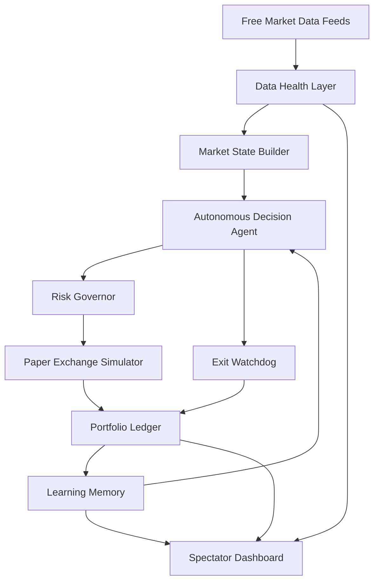

# Kaggle AI Agents Capstone: Antigravity Build Brief

## Purpose

This file is the working brief for upgrading and presenting the Autonomous Paper Trading Agent as a strong submission for Kaggle's "AI Agents: Intensive Vibe Coding Capstone Project".

The goal is not to claim guaranteed trading profit. The goal is to demonstrate a serious, safe, explainable AI agent system that observes real-world market data, makes autonomous paper-trading decisions, manages simulated risk, records outcomes, learns from results, and can be deployed publicly for judges to inspect.

Recommended project framing:

> A free, deployable autonomous paper-trading research agent that demonstrates real-time observation, agentic decision-making, risk governance, memory, explainability, MCP-style tool access, and safe public spectator access.

Recommended Kaggle track:

> Freestyle

Secondary possible track:

> Agents for Business

Freestyle is safer because it lets the project be judged as an agentic research system instead of only as a profit-generating business tool.

## Kaggle Requirements To Satisfy

Kaggle says the submission should demonstrate at least 3 key concepts. This project should aim to demonstrate 6:

| Kaggle Concept | Where To Demonstrate | Current Status | Upgrade Needed |
|---|---|---|---|
| Agent / Multi-agent system | Code, README, video | Strong foundation exists | Document as agent modules and add clearer boundaries |
| MCP Server | Code | Not clearly present yet | Add safe read-only MCP server/tools |
| Antigravity | Video | User already used it | Show Antigravity workflow in demo |
| Security features | Code and video | Strong foundation exists | Document spectator/admin separation and paper-only execution |
| Deployability | Video and README | Strong foundation exists | Improve deployment docs and domain/TLS story |
| Agent skills / CLI | Code or video | Partly present through scripts | Add explicit `agent:*` scripts for status/audit/explain |

## Winning Strategy

Judges will not only inspect whether the bot traded profitably. They will evaluate:

- Clear problem definition.
- Meaningful use of agents.
- Architecture quality.
- Technical implementation.
- Tool use.
- Safety.
- Documentation.
- Video clarity.
- Public accessibility.

Therefore, the winning version should prioritize:

1. Explainability.
2. Safe read-only public demo.
3. Clear agent loop.
4. Documented memory/learning system.
5. Deployability.
6. Security and no exposed secrets.
7. Clean video story.

Avoid positioning the project as:

> An AI bot that guarantees profit.

Position it as:

> A safe autonomous paper-trading AI agent for studying disciplined market decision-making.

## Core Agent Architecture To Present

Use this architecture in README, Kaggle writeup, and video.



### Agent Roles

#### 1. Market Observer Agent

Responsibility:

- Fetch free public market data.
- Normalize candles.
- Detect stale/degraded data.
- Feed clean market state into the decision system.

Evidence in code:

- `src/lib/market.ts`
- `src/lib/data/*`
- chart/status APIs.

Video demo:

- Show Data Health or feed status.
- Explain that the bot does not blindly trust every API response.

#### 2. Decision Agent

Responsibility:

- Evaluate technical confluence.
- Decide `ENTRY`, `HOLD`, `SKIPPED`, or `BLOCKED`.
- Explain why a trade was or was not taken.

Evidence in code:

- Swing scan logic.
- Signal logic.
- Autonomous decision files.

Video demo:

- Show "Autonomous Swing Scan".
- Explain one row where the bot waits because evidence is insufficient.

#### 3. Risk Governor Agent

Responsibility:

- Prevent reckless position sizing.
- Cap leverage and margin.
- Enforce drawdown rules.
- Block trades during unsafe data conditions.

Evidence in code:

- Risk manager files.
- Trade admission / asset specs.
- Strategy audit script.

Video demo:

- Show strategy audit output or explain risk limits.
- Emphasize paper trading only.

#### 4. Paper Execution Agent

Responsibility:

- Simulate order execution.
- Record entry/exit.
- Track realized and unrealized P&L.
- Separate AI portfolio from human portfolio.

Evidence in code:

- Paper exchange.
- Portfolio manager.
- Trade routes.

Video demo:

- Show AI vs Human portfolio.
- Explain it is simulated, not real-money execution.

#### 5. Exit Watchdog Agent

Responsibility:

- Monitor active positions.
- Protect profit.
- Cut invalidated trades.
- Avoid leaving positions unmanaged.

Evidence in code:

- Swing lifecycle / exit sweep logic.
- Watchdog status on dashboard.

Video demo:

- Show active scan/exits if available.
- If no trade is open, explain watchdog is always active.

#### 6. Learning Agent

Responsibility:

- Record watched opportunities.
- Compare later outcomes.
- Learn which setups are helpful or dangerous.
- Adjust future confidence.

Evidence in code:

- Opportunity journal.
- Local learning.
- Setup performance.

Video demo:

- Show Opportunity Radar / learning section.
- Explain the bot learns from both trades and missed opportunities.

## Upgrade Sprint 1: MCP Server

### Objective

Add a read-only MCP server that exposes the trading system state to external agents or assistants without allowing trade execution.

This directly satisfies:

- MCP Server.
- Agent tool use.
- Security features.

### Safety Rule

The MCP server must be read-only.

Do not expose:

- Manual trade execution.
- Reset portfolio.
- Admin mutation routes.
- API keys.
- Environment secrets.

### Suggested Folder

```text
mcp/
  trading_mcp_server.ts
  README.md
```

### Suggested MCP Tools

#### `get_portfolio_status`

Returns:

- AI portfolio value.
- Human portfolio value.
- AI realized P&L.
- Open positions count.
- Total trades.

#### `get_latest_scan`

Returns:

- Last scan ID.
- Summary counts.
- Assets scanned.
- Main blockers.
- Timestamp.

#### `get_data_health`

Returns:

- Feed health summary.
- Degraded assets.
- Warnings.

#### `get_learning_summary`

Returns:

- Watched opportunities.
- Helpful move rate.
- Active learning rules.
- Best/worst setup.

#### `get_public_demo_summary`

Returns a judge-friendly summary:

- What the system is doing.
- Whether it is currently trading or waiting.
- Why it is safe.
- Current paper portfolio state.

### Implementation Notes

The MCP server can call existing internal status logic or read from Redis/API.

Preferred:

- Keep it separate from production dashboard runtime.
- Use environment variables for endpoint/token if needed.
- Never hardcode passwords.

### Demo Script Line

> "I added a read-only MCP server so an external agent can inspect the bot's portfolio, latest scan, data health, and learning memory without being allowed to execute trades."

## Upgrade Sprint 2: ADK-Compatible Reviewer Agent

### Objective

Add a small Google ADK-compatible or ADK-inspired reviewer agent that safely reviews the bot's state.

This directly satisfies:

- Agent / multi-agent system.
- ADK concept.
- Security.

### Suggested Folder

```text
agents/
  trading_reviewer_agent.py
  README.md
```

### Agent Purpose

The reviewer agent should not place trades.

It should:

- Read latest status.
- Summarize what the trading bot is doing.
- Explain whether the bot is waiting, trading, blocked, or learning.
- Identify risk warnings.
- Produce a plain-English report.

### Suggested Agent Prompt

```text
You are a read-only trading system reviewer. Your job is to inspect the paper-trading agent's latest state, explain what it is doing, identify risk warnings, and summarize whether the system is behaving safely. You must never recommend real-money trading or execute orders.
```

### Expected Output

```text
System state: active
Latest scan: no entries, 9 skipped
Reason: active positions and/or closed market rules
Portfolio: AI currently below initial capital
Safety: paper trading only, no real-money execution
Recommendation: continue observing; no manual intervention required
```

### Demo Script Line

> "The trading bot is the autonomous operational agent, and this ADK-style reviewer agent is a safety/explainability agent that inspects the system without changing it."

## Upgrade Sprint 3: Agent CLI Scripts

### Objective

Add explicit command-line tools that show judges the agent can be inspected and audited from terminal.

This satisfies:

- Agent skills.
- Deployability.
- Technical implementation.

### Suggested Scripts

Add to `package.json`:

```json
{
  "scripts": {
    "agent:status": "tsx scripts/agent-status.ts",
    "agent:audit": "tsx scripts/strategy-audit.ts",
    "agent:explain": "tsx scripts/explain-latest-scan.ts"
  }
}
```

### `scripts/agent-status.ts`

Should print:

- Dashboard API status.
- AI total value.
- AI P&L.
- Last scan summary.
- Container/deploy note if local only.

### `scripts/explain-latest-scan.ts`

Should print:

- What the bot did last scan.
- Why it did not trade.
- Any warnings.
- Whether the system is safe.

### Demo Script Line

> "I also added agent CLI commands so the system can be audited without using the UI."

## Upgrade Sprint 4: Kaggle README Upgrade

### Objective

Rewrite or extend `README.md` so a judge can understand the project without reading the whole codebase.

### Required README Sections

```text
# Autonomous Paper Trading Agent

## Problem
Humans overtrade, miss setups, and cannot watch multiple markets continuously.

## Solution
An autonomous paper-trading agent that observes markets, waits for confluence, manages risk, explains decisions, and learns from outcomes.

## Live Demo
Public spectator URL.

## Kaggle Capstone Concepts Demonstrated
- Agent system
- MCP server
- Antigravity workflow
- Security features
- Deployability
- Agent CLI skills

## Architecture
Mermaid diagram.

## Agent Loop
Observe -> Decide -> Risk Check -> Paper Execute -> Monitor -> Learn.

## Safety
Paper trading only. No real-money brokerage execution. Spectator mode is read-only.

## Tech Stack
Next.js, TypeScript, Redis, Docker, Oracle VPS, Nginx, free market APIs.

## Local Setup
Commands.

## Deployment
Docker Compose and VPS notes.

## Limitations
Free APIs can be stale/degraded. No profit guarantee. Paper trading only.

## Future Work
Better data feeds, stronger ML calibration, broker sandbox, richer evaluations.
```

### Important README Safety Language

Use:

> This project is an educational paper-trading simulation. It does not execute real-money trades and does not provide financial advice.

Do not use:

> This bot makes guaranteed profit.

## Upgrade Sprint 5: Kaggle Writeup Draft

### Objective

Create a file the user can paste into Kaggle.

Suggested file:

```text
docs/KAGGLE_WRITEUP_DRAFT.md
```

Word limit:

- Must stay under 2,500 words.

### Suggested Writeup Structure

#### Title

Autonomous Paper Trading Agent: A Safe AI Agent for Market Observation, Simulated Execution, and Learning

#### Subtitle

A free, deployable AI agent system that watches markets, explains trade decisions, manages paper risk, and learns from outcomes.

#### Problem

Retail traders often overtrade, miss setups, and lack consistent risk discipline.

#### Solution

This system creates a paper-trading agent that monitors markets continuously, evaluates confluence, simulates trades, records outcomes, and learns from both trades and missed opportunities.

#### Agent Architecture

Describe the modules from the architecture section.

#### Key Concepts Demonstrated

Mention:

- Agent system.
- MCP server.
- Antigravity.
- Security.
- Deployability.
- Agent CLI skills.

#### Demo

Mention spectator dashboard.

#### Safety

Paper trading only, no real-money execution.

#### Results And Learning

Describe:

- It scans continuously.
- It may choose not to trade.
- It records outcomes.
- It shows portfolio and learning state.

#### Limitations

Free data feeds can be stale.
No profit guarantee.
Market simulation is not live brokerage execution.

#### Future Work

Real broker sandbox, stronger data, formal evaluation pipeline, better ML calibration.

## Upgrade Sprint 6: Demo Video Script

### Objective

Create a 5-minute video script that clearly proves the Kaggle criteria.

Suggested file:

```text
docs/KAGGLE_VIDEO_SCRIPT.md
```

### Video Timeline

#### 0:00-0:30 - Hook

> "Retail traders often overtrade or miss opportunities because markets move continuously. I built an autonomous paper-trading agent that watches markets, reasons about setups, manages simulated risk, and learns from outcomes."

#### 0:30-1:10 - Problem And Value

Show dashboard.

Explain:

- Human vs AI portfolio.
- Paper trading only.
- Continuous scanning.

#### 1:10-2:00 - Architecture

Show Mermaid diagram.

Explain:

- Market observer.
- Decision agent.
- Risk governor.
- Paper execution.
- Learning memory.
- Dashboard.

#### 2:00-2:50 - Demo

Show:

- Public dashboard.
- Swing scan.
- Chart.
- Opportunity radar.
- Performance curve.

Explain what the bot is doing now.

#### 2:50-3:30 - Safety

Show:

- Spectator mode.
- Locked execution.
- No real-money execution.
- Environment variables, no secrets committed.

#### 3:30-4:10 - MCP / Agent CLI / ADK

Show:

- `npm run agent:status`
- MCP tool list or output.
- ADK reviewer report.

#### 4:10-4:40 - Antigravity

Show:

- Google Antigravity development workflow.
- Code inspection or debugging.

#### 4:40-5:00 - Closing

> "This is not a financial advice system. It is a safe agentic research platform for studying autonomous decision-making, explainability, and risk management in a real-world data environment."

## Upgrade Sprint 7: Public Demo And Domain

### Problem

`duckdns.org` can trigger trust warnings or be blocked by school/company Wi-Fi.

This hurts Kaggle demo reliability.

### Recommended Fix

Use a real domain through Cloudflare Free.

### Steps

1. Buy or use a real domain.
2. Add domain to Cloudflare.
3. Add an `A` record:

```text
trader.yourdomain.com -> 138.2.186.85
```

4. Enable orange-cloud proxy.
5. Set SSL/TLS mode to `Full strict`.
6. Keep Certbot on VPS or use a Cloudflare Origin Certificate.
7. Update README and Kaggle project link to the new domain.

### Multi-Demo Future Architecture

```text
trader.yourdomain.com   -> quant dashboard on port 3000
demo2.yourdomain.com    -> next project on port 3001
api.yourdomain.com      -> shared backend/API if needed
```

### Nginx Pattern

Each subdomain should have a separate Nginx server block pointing to the correct local port.

## Upgrade Sprint 8: Security Checklist

### Must Be True Before Submission

- No `.env` or secrets committed.
- No SSH private key committed.
- No admin password in README.
- Spectator mode cannot mutate state.
- Reset endpoints require admin auth.
- Manual trade endpoints require admin auth.
- MCP server is read-only.
- ADK reviewer is read-only.
- Public demo does not require login.
- README clearly says paper trading only.

### Repository Warning

Check if these files are tracked. If tracked, remove them from Git history or at least current repo before public submission:

```text
.env
.env.local
ssh-key-2026-05-31.key
```

They should never be public.

Use `.env.example` instead.

## Upgrade Sprint 9: Submission Assets

Kaggle requires:

- Kaggle Writeup.
- Media Gallery.
- Public Video.
- Project Link.

Prepare:

```text
docs/KAGGLE_WRITEUP_DRAFT.md
docs/KAGGLE_VIDEO_SCRIPT.md
docs/ARCHITECTURE.md
public/kaggle-cover.png
README.md
```

### Cover Image Idea

Use dashboard screenshot plus a title overlay:

```text
Autonomous Paper Trading Agent
Observe. Decide. Simulate. Learn.
```

### Video Assets

Record:

- Dashboard live page.
- Architecture diagram.
- Terminal running `agent:status`.
- Antigravity workspace.
- GitHub README.
- Deployment proof.

## Implementation Priority

Do this in order:

1. Confirm secrets are not committed.
2. Add README Kaggle sections.
3. Add `docs/KAGGLE_WRITEUP_DRAFT.md`.
4. Add `docs/KAGGLE_VIDEO_SCRIPT.md`.
5. Add read-only MCP server.
6. Add ADK-style reviewer agent.
7. Add `agent:*` CLI scripts.
8. Improve public domain/TLS with Cloudflare.
9. Record video.
10. Submit Kaggle writeup.

## What Not To Do

Do not:

- Add real-money trading.
- Add hidden admin shortcuts.
- Claim guaranteed profit.
- Overcomplicate the strategy right before submission.
- Expose logs/secrets in public mode.
- Make the video mostly about trading profits.

## Best Final Pitch

Use this language:

> This project demonstrates a safe, autonomous AI agent operating in a real-world data environment. It observes market conditions, reasons over trade setups, checks risk constraints, simulates paper execution, monitors outcomes, and learns from both trades and missed opportunities. The system is deployable, inspectable, and designed with spectator safety so judges can evaluate it publicly without real-money risk.

## Antigravity Work Prompt

Use this prompt in Google Antigravity:

```text
You are helping prepare this project for the Kaggle AI Agents Intensive Vibe Coding Capstone. Please inspect the repository and implement the Kaggle-focused upgrades from docs/KAGGLE_CAPSTONE_ANTIGRAVITY_BRIEF.md.

Priorities:
1. Keep the trading system paper-only and safe.
2. Do not expose secrets.
3. Add read-only MCP tools for portfolio/status/scan/data-health/learning inspection.
4. Add an ADK-style reviewer agent that summarizes system state without executing trades.
5. Add agent CLI scripts for status, audit, and latest-scan explanation.
6. Upgrade README with Kaggle problem, solution, architecture, safety, setup, deployment, and diagrams.
7. Draft Kaggle writeup and video script under docs/.
8. Keep changes minimal, high-quality, and easy to review.

Do not add real-money brokerage execution. Do not claim guaranteed profit. Treat this as a safe autonomous paper-trading research agent.
```

## Definition Of Done

The Kaggle-ready version is done when:

- Public spectator dashboard opens reliably.
- README explains project clearly.
- At least 3 Kaggle concepts are explicitly demonstrated.
- MCP server exists and is read-only.
- ADK-style reviewer agent exists or is clearly documented.
- Agent CLI commands run.
- Video script is ready.
- Kaggle writeup draft is ready.
- No secrets are committed.
- Demo can be understood by a non-trading judge in under 5 minutes.

