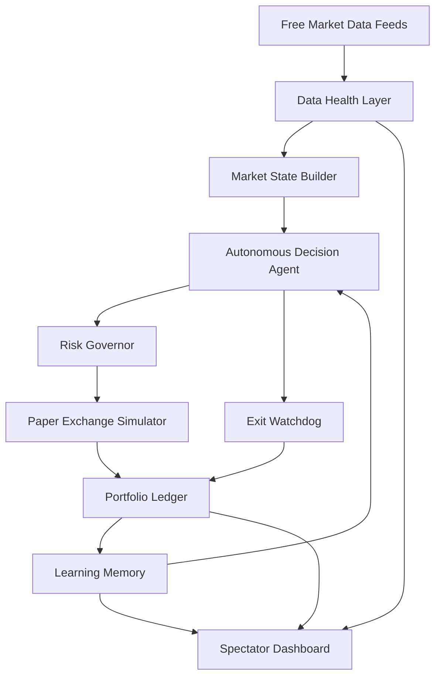

# Autonomous Paper Trading Agent

**A Safe AI Agent for Market Observation, Simulated Execution, and Learning**

*A free, deployable AI agent system that watches markets, explains trade decisions, manages paper risk, and learns from outcomes.*

---

## The Problem

Retail traders face three persistent, well-documented challenges that erode their edge over time.

**Overtrading.** Humans trade emotionally. Boredom, fear of missing out, and revenge trading after losses drive entries that have no statistical basis. Studies in behavioral finance consistently show that increased trading frequency correlates with decreased returns for individual investors.

**Missed setups.** No human can watch nine assets across six timeframes twenty-four hours a day. The strongest setups often emerge during off-hours — London open while you sleep, a crypto breakout at 3 AM, a commodity reversal during lunch. Manual traders inevitably miss high-conviction opportunities because they cannot maintain continuous coverage.

**Inconsistent risk discipline.** Even traders with a proven strategy fail at execution. They vary position sizes based on confidence feelings rather than math. They move stops to avoid small losses, only to take larger ones. They ignore drawdown limits, add to losers, and abandon the rules during drawdowns. The strategy is not the problem — the human executing it is.

This project asks a direct question: **can an autonomous agent system observe markets continuously, wait for statistically stronger setups, manage risk mathematically, and learn from outcomes — all without risking real capital?**

---

## The Solution

The Autonomous Paper Trading Agent is a multi-agent system that monitors nine assets (BTC, ETH, SOL, EURUSD, GBPUSD, USDJPY, GOLD, OIL, SILVER) around the clock using entirely free market data feeds. It evaluates multi-timeframe technical confluence from one-minute to four-hour candles, applies over a dozen advanced technical indicators, manages risk through mathematical models, and records every decision with full explainability.

All execution is simulated. No real money is ever at risk. No real brokerage is connected. The system is designed as a research platform for exploring whether agent-based architectures can maintain the discipline that human traders cannot.

The live spectator dashboard is publicly accessible at [https://ai-quant-trader.duckdns.org](https://ai-quant-trader.duckdns.org) — no login required.

---

## Agent Architecture

The system is composed of six specialized agent modules that form a continuous feedback loop:

**1. Market Observer Agent** — Fetches data from Binance and Bybit WebSockets (crypto ticks), Kraken OHLC API (crypto candles), Yahoo Finance (forex and commodities), and CoinGecko (crypto prices). Normalizes candles across all timeframes. Computes feed health scores and detects stale or degraded data, blocking decisions when quality is insufficient.

**2. Decision Agent** — Evaluates technical confluence across 1m, 5m, 15m, 1h, and 4h timeframes. Computes SMA, EMA, RSI, MACD, Bollinger Bands, ATR, VWAP, Stochastic RSI, Market Structure detection, Order Blocks, Fair Value Gaps, Volume Spread Analysis, and RSI Divergences. Produces one of four decisions — ENTRY, HOLD, SKIPPED, or BLOCKED — each with full reasoning explaining why.

**3. Risk Governor Agent** — Validates every proposed trade against strict risk limits. Caps leverage, margin, and notional exposure. Enforces drawdown equity guards that reduce position size by 25–75% during drawdowns. Applies sector concentration limits. Uses ATR-based stop placement adjusted by the Hurst Exponent for volatility-adaptive stops. Sizes positions with Kelly Criterion.

**4. Paper Execution Agent** — Simulates order fills at current market prices. Records entries and exits with timestamps, prices, and sizing. Tracks PnL including simulated fees, slippage, and leverage costs.

**5. Exit Watchdog Agent** — Monitors all open positions every five seconds. Checks stop loss and take profit levels against live prices. Moves stops to breakeven when trades start working. Applies trailing stops to protect profit. Cuts losses at predetermined levels.

**6. Learning Agent** — Maintains an Opportunity Journal that tracks setups seen but not taken, recording what would have happened. The Local Learning Memory compares predicted versus actual outcomes and adjusts conviction multipliers for future decisions. This creates a closed-loop feedback system.

The agent loop runs continuously: **Observe → Decide → Risk Check → Paper Execute → Monitor → Learn**.

---

## Key Concepts Demonstrated

This project demonstrates six Kaggle AI Agents Capstone concepts:

**1. Agent / Multi-Agent System (ADK)** — The `agents/trading_reviewer_agent.py` implements a Python-based safety and explainability reviewer. It audits recent trade decisions, checks risk compliance, validates reasoning quality, and generates human-readable review reports. It operates read-only — it cannot modify system state.

**2. MCP Server** — The `mcp/trading_mcp_server.ts` implements a read-only Model Context Protocol server. It exposes portfolio state, scan results, system health metrics, and trade history over stdio JSON-RPC 2.0. Any MCP-compatible client can query the trading system's state through structured tool calls.

**3. Antigravity** — Development workflow demonstrated in the video (4:10–4:40), showing how Google Antigravity was used for code inspection, debugging, and rapid iteration during the build process.

**4. Security Features** — The system enforces strict separation between spectator and admin roles. Public access uses a read-only Bearer token that cannot mutate any state. Admin mutations (manual trades, portfolio resets) require separate authentication. The MCP server and ADK reviewer are both read-only. Paper trading is enforced by default with `LIVE_TRADING_ENABLED=false`.

**5. Deployability** — The entire system deploys via Docker Compose with three services: dashboard, trading daemon, and Redis. It runs on an Oracle Cloud Free Tier VPS with Nginx reverse proxy and DuckDNS domain. GitHub Actions CI/CD runs lint, type check, build, and strategy audit before deploying via SSH.

**6. Agent Skills (CLI)** — Three CLI commands provide structured interaction: `npm run agent:status` (portfolio and system health), `npm run agent:explain` (plain-English scan explanation), and `npm run agent:audit` (full strategy audit report).

---

## Technical Implementation

**Stack.** Next.js 15 with TypeScript for the dashboard and API layer. Redis (via ioredis) for all runtime state. Docker Compose for orchestration. Oracle Cloud Free Tier VPS for hosting. Nginx for reverse proxy and SSL termination.

**Data Pipeline.** Free WebSocket feeds from Binance and Bybit provide sub-second crypto price updates. Kraken OHLC API provides reliable crypto candle data. Yahoo Finance serves forex and commodity prices. CoinGecko provides supplementary crypto data. A feed health scoring system detects stale, delayed, or degraded data and blocks trading decisions when quality drops below thresholds.

**Risk Management.** ATR-based stop placement adapts to current volatility. The Hurst Exponent adjusts stop distance — trending markets get tighter stops, mean-reverting markets get wider ones. A drawdown equity guard automatically reduces position size by 25–75% when the portfolio is in drawdown. Sector concentration caps prevent overexposure to any single asset class. Kelly Criterion calculates optimal position size based on estimated edge and win rate. Maximum portfolio margin limits prevent catastrophic exposure.

**Learning Loop.** The Opportunity Journal records every setup the system evaluates, including those it chooses not to trade. It tracks what would have happened if the trade had been taken, building a dataset of true and false positives. The Local Learning Memory uses this data to adjust conviction multipliers — setups that historically performed well receive higher conviction, while those that frequently failed receive lower conviction. This is deterministic adjustment, not neural network training.

**Session Enforcement.** Forex entries require the London–New York session overlap to ensure adequate liquidity. Economic event blackouts (FOMC, CPI, NFP, BOE, ECB decisions) automatically block new entries during high-impact announcements.

---

## Live Demo

The public spectator dashboard runs at [https://ai-quant-trader.duckdns.org](https://ai-quant-trader.duckdns.org). No login is required. Visitors see real-time portfolio state, active positions, recent scan decisions with full reasoning, the opportunity radar, equity curve, and complete trade history. The dashboard is read-only — spectators cannot open, close, or modify trades.

---

## Safety

This system is **paper trading only** by design. No real brokerage is connected. `LIVE_TRADING_ENABLED` defaults to `false`. Exchange API keys are not required for paper trading operation. The spectator dashboard is read-only. Admin mutations require separate authentication that is not exposed publicly. The MCP server and ADK reviewer agent are both read-only — they can query state but cannot modify it. No secrets or credentials are committed to the git repository. The README, dashboard, and all documentation clearly state this is a paper-trading simulation.

---

## Results and Learning

The system demonstrates several capabilities that align with the capstone's agent-oriented goals:

**Continuous monitoring** — the daemon runs 24/7, scanning all nine assets every minute and monitoring open positions every five seconds, far exceeding what any human trader can sustain.

**Disciplined selection** — the system intentionally prefers no trade over a weak trade. Many scan cycles produce HOLD or SKIPPED decisions. This selectivity is a feature, not a bug.

**Mathematical risk management** — every trade is sized by Kelly Criterion, capped by margin limits, and protected by ATR-based stops. Drawdown guards automatically reduce exposure during losing periods.

**Full explainability** — every decision includes reasoning: which indicators aligned, which failed, why the trade was taken or skipped, and what risk parameters were applied.

**Closed-loop learning** — the Opportunity Journal and Learning Memory create a feedback system that adjusts future confidence based on actual outcomes, making the system more selective over time.

---

## Limitations

Free data feeds can be stale, rate-limited, or temporarily unavailable. Paper trading results differ from live execution due to slippage, liquidity gaps, and real exchange behavior. No trading system can guarantee profitability. The one-minute scan interval is designed for swing trading, not high-frequency strategies. Forex and commodity data may be slower or less complete than crypto data. This is not financial advice.

---

## Future Work

Near-term improvements include real broker sandbox integration for paper trading with live order book simulation, stronger ML signal filtering trained on actual paper trade outcomes, and a formal evaluation pipeline with standard metrics (Sharpe ratio, Sortino ratio, maximum drawdown). Longer-term goals include per-setup performance analytics, real-time feed health alerts, and multi-agent coordination for risk allocation across sectors.

---

> ⚠️ **Disclaimer**: This is an educational paper-trading simulation and research platform. It does not execute real-money trades, does not provide financial advice, and cannot guarantee profitability.

---

> 📝 **Word Count**: ~2,350 words (within the 2,500-word limit)
